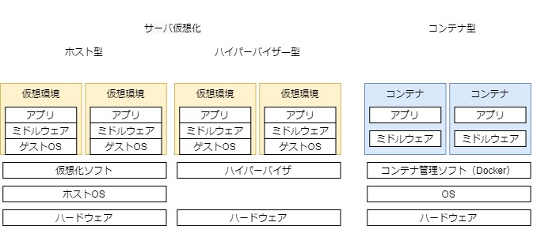
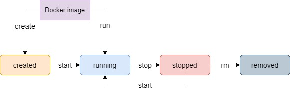
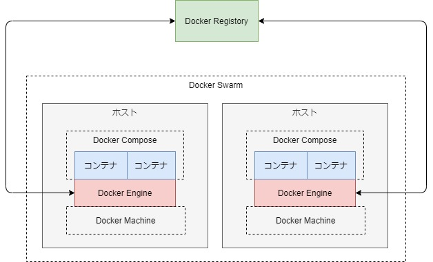

# 1. Docker概要

- Dockerは、コンテナ技術を使ったアプリケーションの実行環境を構築・運用するためのプラットフォーム。
- コンテナとは、ホストOS上に論理的に作られた区画で、アプリケーション・ミドルウェアの**ファイル群**をひとまとまりとしたもの。
- コンテナ同士はホストOS上のリソースを論理的に分離する（namespace, cgroups）ので、１つのサーバーとして扱うことができる。
-  コンテナは、サーバー仮想化技術にくらべ軽量。（ゲストOSを保持しないことが大きい）
    
- Dockerを使ってコンテナを作成するには、Dockerfileを元に作成したイメージを使用する。
    - Dockerfile
        - ↓
    - Docker image　// DockerHubで公開されているものを利用可
        - ↓
    - Docker Container
- 尚、DockerfileでもOSを指定するが、これはパッケージ管理のためのOS
に過ぎない。アプリケーションを実際に動かしているのは、ホストOS上で稼働するLinux。
    - https://teratail.com/questions/124191
- コンテナのライフサイクル

    
- Dockerの各種コンポーネント

    |コンポーネント名|概要|
    |--|--|
    |Docker Engine|Dockerのコア機能|
    |Docker Registory|イメージ公開／共有|
    |Docker Compose|複数コンテナ一元管理|
    |Docker Machine|Docker実行環境構築|
    |Docker Swarm|クラスタ管理|

    

参考：
- プログラマのためのDocker教科書 第２版