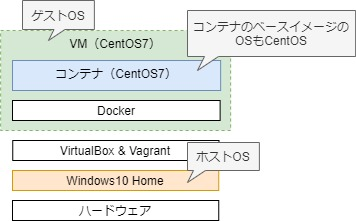
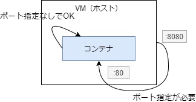
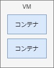

# 3. Dockerコマンド実行例

- [3-1. Docker Engine](#a1)
  - [3-1-1. コンテナ操作](#a1-1)
  - [3-1-2. ポート](#a1-2)
  - [3-1-3. 名前解決](#a1-3)
  - [3-1-4. IP指定](#a1-4)
- [3-2. Docker Engine（イメージ作成）](#a2)
- [3-3. DockerCompose](#a3)
  - [3-3-1. 通常パターン（ポート指定あり）](#a3-1)
  - [3-3-2. スケール（ポート指定なし）](#a3-2)
  - [3-3-3. スケール（ポート開放あり）](#a3-3)

<span id="a1">

## 3-1. Docker Engine

<span id="a1-1">

### 3-1-1 コンテナ操作

CentOS7のコンテナを立ち上げbashでログインし、最終的にコンテナを削除するところまでを記載する。



#### A. イメージを検索
Docker Hub
- https://hub.docker.com/_/centos
#### B. コンテナ起動
```sh
# ログインするには、"-it"が必要
$ docker run -it centos:centos7 /bin/sh

sh-4.2# echo Hello World!
Hello World!

# ログアウト
sh-4.2# exit
```
確認  
※ 以下「docker ps」コマンドでも同様の結果を得られる
```sh
# 起動中コンテナ確認
$ docker container ls
CONTAINER ID        IMAGE               COMMAND             CREATED             STATUS              PORTS               NAMES

# 全コンテナ確認
$ docker container ls -a
CONTAINER ID        IMAGE               COMMAND             CREATED              STATUS                      PORTS               NAMES
b50708473c78        centos:centos7      "/bin/sh"           About a minute ago   Exited (0) 11 seconds ago                       compassionate_gauss # ★
```
- ログアウトすると、コンテナは停止状態になるので-aをつけないと表示されなかった。

再ログイン
```sh
# コンテナを再開。コンテナIDは前方一致入力でok
# あるいはコンテナ名指定でもok
# $ docker start compassionate_gauss
$ docker start b50
b50

$ docker container ls
CONTAINER ID        IMAGE               COMMAND             CREATED             STATUS              PORTS               NAMES
b50708473c78        centos:centos7      "/bin/sh"           13 minutes ago      Up 3 seconds                            compassionate_gauss

# ログイン
$ docker exec -it b50 /bin/sh

sh-4.2# exit
```

#### C. コンテナ停止・削除
```sh
# 停止
$ docker container stop b50
b50

# 削除 ※ 停止していないと削除できない
$ docker container rm b50
b50

# 強制削除(-f)すれば停止してなくても削除ok
// $ docker container rm b50 -f

$ docker container ls
# $ docker ps
CONTAINER ID        IMAGE               COMMAND             CREATED             STATUS              PORTS               NAMES
```
参考：https://weblabo.oscasierra.net/docker-centos7/

#### D. その他
##### 1. コンテナ停止とともに自動削除するための起動方法
```sh
$ docker run --rm -it -d centos:centos7
```
##### 2. 不要コンテナ一括削除
stop中のコンテナを一括で削除する。
```sh
$ docker container prune
```

<span id="a1-2">

### 3-1-2. ポート

ポート指定なし
```sh
# -dでデタッチ起動
$ docker container run -d httpd

$ docker ps
CONTAINER ID        IMAGE               COMMAND              CREATED             STATUS              PORTS               NAMES
1cd79c74abf9        httpd               "httpd-foreground"   33 seconds ago      Up 33 seconds       80/tcp              funny_shamir

# IPアドレス確認
$ docker inspect 1cd | grep IPAddress
            "SecondaryIPAddresses": null,
            "IPAddress": "172.17.0.3",
                    "IPAddress": "172.17.0.3",

# コンテナのIPアドレス指定はOK
$ curl 172.17.0.3
<html><body><h1>It works!</h1></body></html>

# ホストOSのIPアドレス指定はNG
$ curl 192.168.33.11
curl: (7) Failed connect to 192.168.33.11:80; Connection refused
```
ポート指定あり
- ホスト指定でアクセスしたい場合は、port指定が必須。

  
```sh
# ホスト側ポート8080とコンテナ側ポート80をリンク
$ docker container run -d -p 8080:80 httpd

$ docker ps
CONTAINER ID        IMAGE               COMMAND              CREATED             STATUS              PORTS                  NAMES
e695141729b8        httpd               "httpd-foreground"   3 seconds ago       Up 2 seconds        0.0.0.0:8080->80/tcp   jovial_ramanujan

# IPアドレス確認
$ docker inspect e69 | grep IPAddress
            "SecondaryIPAddresses": null,
            "IPAddress": "172.17.0.2",
                    "IPAddress": "172.17.0.2",

# コンテナのIPアドレス指定はOK
$ curl 172.17.0.2
<html><body><h1>It works!</h1></body></html>

# ホストOSのIPアドレス指定もOK
$ curl 192.168.33.11:8080
<html><body><h1>It works!</h1></body></html>
```

<span id="a1-3">

### 3-1-3. 名前解決
デフォルトではコンテナのIPアドレスの名前解決はできない。  
ユーザー定義ネットワークに接続すれば可能。（[こちら](Docker04.md)を参照のこと）
- あくまで同一ホスト内であればの話。マルチコンテナの場合は不可。後述。

※ VirtualBoxの場合、ホストOS -> ゲストOS内コンテナの名前解決は不可

<span id="a1-4">

### 3-1-4. IP指定
デフォルトではコンテナのIP指定はできない。（DHCPが適用される）  
ユーザー定義ネットワークに接続すれば指定可能。（[こちら](Docker04.md)を参照のこと）
```sh
# ユーザー定義ネットワークを作成
$ docker network create --subnet=172.22.0.0/16 subnetnw

# コンテナ起動時にネットワークを指定(--net)
$ docker container run -it --name fixip --net subnetnw --ip 172.22.0.100 centos:centos7 /bin/sh

[root@9cea2d5f01ce /]# hostname -i
172.22.0.100

[root@9cea2d5f01ce /]# exit

# 関係ないが、コンテナ名指定で特定できる
$ docker inspect fixip | grep IPAddress
            "SecondaryIPAddresses": null,
            "IPAddress": "",
                    "IPAddress": "172.22.0.100", # ★
```

<details><summary>エラーになる場合</summary>

ユーザーネットワーク作成時はサブネットの指定が必要。

```sh
$ docker network create subnetnw0

$ docker container run -it --net subnetnw0 --ip 172.17.0.100 centos:centos7 /bin/sh
docker: Error response from daemon: user specified IP address is supported only when connecting to networks with user configured subnets.
```
参考：https://gist.github.com/mapk0y/3dd5d270e9c058ef3ab9

</details>

<span id="a2">

## 3-2. Docker Engine（イメージ作成から）
### A. Dockerfile作成
```sh
# Dockerfileの作成
$ vi Dockerfile
FROM centos:centos7 # ベースイメージはcentos7にした

RUN yum install httpd -y

RUN sh -c "echo 'This is Host A.' > /var/www/html/index.html"

# これは目印（実際の挙動には影響なし）
EXPOSE 80

ENTRYPOINT ["/usr/sbin/httpd", "-DFOREGROUND"]
```

### B. ビルド
```sh
$ docker build -t httpd-test .

# 確認
$ docker image ls | head
REPOSITORY          TAG                 IMAGE ID            CREATED              SIZE
httpd-test          latest              ef8105e0628d        8 days ago           300MB
```

### C. コンテナ起動
```sh
$ docker container run -d -p 8080:80 httpd-test

$ docker container ls
CONTAINER ID        IMAGE               COMMAND                  CREATED             STATUS              PORTS                  NAMES
c01aa7b3db43        httpd-test          "/usr/sbin/httpd -DF…"   9 seconds ago       Up 9 seconds        0.0.0.0:8080->80/tcp   affectionate_brattain
```
WSL
```sh
$ curl 192.168.33.11:8080
This is Host A.
```
参考：
- httpd: https://blog.takekoshi.net/docker-centos7-httpd/
- EXPOSE: https://shinkufencer.hateblo.jp/entry/2019/01/31/233000

<span id="a3">

## 3-3. DockerCompose

DockerComposeでは、今までdockerコマンドで実行した内容をymlファイルにまとめることができる。

また、複数コンテナの定義も1つのファイルにまとめることができる。（当ドキュメントでは触れない）

<span id="a3-1">

### 3-3-1. 通常パターン（ポート指定あり）

VM
```sh
# ymlファイル定義
$ vi docker-compose.yml
version: '3.7'
services:
  web:
    build: . # 先ほど作ったDockerfileを使用してみた
    ports:
      - "80:80"

# コンテナ起動
$ docker-compose up -d
Creating network "vagrant_default" with the default driver
```
WSL
```sh
# アクセスしてみる
$ curl 192.168.33.11
This is Host A.
```
VM
```sh
$ docker ps
CONTAINER ID        IMAGE               COMMAND                  CREATED             STATUS              PORTS                NAMES
ac913d4943e6        vagrant_web         "/usr/sbin/httpd -DF…"   14 seconds ago      Up 13 seconds       0.0.0.0:80->80/tcp   vagrant_web_1

# CentOS上に手動で立てたhttpdのログは/var/log/httpdに出力される
$ docker exec -it vagrant_web_1 tail -2 /var/log/httpd/access_log
192.168.33.11 - - [20/May/2020:03:31:20 +0000] "GET / HTTP/1.1" 200 16 "-" "curl/7.29.0"

# 停止
$ docker-compose stop
```

<span id="a3-2">

### 3-3-2. スケール（ポート指定なし）

```sh
$ vi docker-compose-scale.yml
version: '3.7'
services:
  web:
    image: httpd　# 公開されているhttpdのイメージを使用してみた

# プロセスを2つ立ててスケールさせる。
# ファイル名指定は-f（デフォルトはdocker-compose.yml）
$ docker-compose -f docker-compose-scale.yml up -d --scale web=2

$ docker ps
CONTAINER ID        IMAGE               COMMAND              CREATED              STATUS              PORTS                NAMES
0709b458c180        httpd               "httpd-foreground"   About a minute ago   Up 58 seconds       0.0.0.0:81->80/tcp   vagrant_web_1
00bd446c631c        httpd               "httpd-foreground"   About a minute ago   Up 58 seconds       0.0.0.0:80->80/tcp   vagrant_web_2

$ docker inspect vagrant_web_1 | grep IPAddress
            "SecondaryIPAddresses": null,
            "IPAddress": "",
                    "IPAddress": "172.25.0.2",

$ docker inspect vagrant_web_2 | grep IPAddress
            "SecondaryIPAddresses": null,
            "IPAddress": "",
                    "IPAddress": "172.25.0.3",

$ curl 172.25.0.2
<html><body><h1>It works!</h1></body></html>

$ curl 172.25.0.3
<html><body><h1>It works!</h1></body></html>

# 公開イメージを使ったコンテナのログは標準出力に出力される。
# 標準出力の内容はdocker logsで確認できる。
$ docker logs vagrant_web_1
AH00558: httpd: Could not reliably determine the server's fully qualified domain name, using 172.25.0.2. Set the 'ServerName' directive globally to suppress this message
[Wed May 20 03:21:36.238898 2020] [mpm_event:notice] [pid 1:tid 140289830134912] AH00489: Apache/2.4.43 (Unix) configured -- resuming normal operations
[Wed May 20 03:21:36.246789 2020] [core:notice] [pid 1:tid 140289830134912] AH00094: Command line: 'httpd -D FOREGROUND'
172.25.0.1 - - [20/May/2020:03:22:26 +0000] "GET / HTTP/1.1" 200 45 # ★

$ docker logs vagrant_web_2
・・・
172.25.0.1 - - [20/May/2020:03:23:02 +0000] "GET / HTTP/1.1" 200 45 # ★

# 停止
$ docker-compose stop
```
参考：
- version: https://github.com/docker/docker.github.io/blob/master/compose/compose-file/compose-versioning.md#version-3
- docker-compose -f: http://docs.docker.jp/compose/reference/docker-compose.html
- docker logs: 
  > Dockerが公式に提供されているアプリケーションイメージでは標準出力に各種ログを出力するよう設定されているものが多い。  
  https://knowledge.sakura.ad.jp/6752/

<span id="a3-3">

### 3-3-3. スケール（ポート開放あり）

ポート指定をすると、ホスト側のipアドレスで通信できる。

VM
```sh
$ vi docker-compose-scale.yml
version: '3.7'
services:
  web:
    image: httpd
    ports:
      - "80-81:80" # ポートをレンジにしないとポート重複エラーになる

# プロセスを2つ立ててスケールさせる
# ワーニング出るけど気にしない
$ docker-compose -f docker-compose-scale.yml up -d --scale web=2
Creating network "vagrant_default" with the default driver
WARNING: The "web" service specifies a port on the host. If multiple containers for this service are created on a single host, the port will clash.
Creating vagrant_web_1 ... done
Creating vagrant_web_2 ... done

$ docker ps
CONTAINER ID        IMAGE               COMMAND              CREATED             STATUS              PORTS                NAMES
7041b0067967        httpd               "httpd-foreground"   6 minutes ago       Up 6 minutes        0.0.0.0:81->80/tcp   vagrant_web_1
200ffa6e2e42        httpd               "httpd-foreground"   6 minutes ago       Up 6 minutes        0.0.0.0:80->80/tcp   vagrant_web_2
```
WSL
```sh
# レンジにしたポートでアクセス
$ curl 192.168.33.11:81
$ curl 192.168.33.11:81/bbb
$ curl 192.168.33.11:80
$ curl 192.168.33.11:80/aaa
```
VM
```sh
# ログ確認（標準エラーは破棄）
$ docker logs vagrant_web_1 2>/dev/null
192.168.33.11 - - [20/May/2020:03:06:43 +0000] "GET / HTTP/1.1" 200 45
192.168.33.11 - - [20/May/2020:03:06:45 +0000] "GET /bbb HTTP/1.1" 404 196

$ docker logs vagrant_web_2 2>/dev/null
192.168.33.11 - - [20/May/2020:03:06:34 +0000] "GET / HTTP/1.1" 200 45
192.168.33.11 - - [20/May/2020:03:06:38 +0000] "GET /aaa HTTP/1.1" 404 196

# 停止＆削除
$ docker-compose down
Stopping vagrant_web_1 ... done
Stopping vagrant_web_2 ... done
Removing vagrant_web_1 ... done
Removing vagrant_web_2 ... done
Removing network vagrant_default
```
参考：
- https://kiririmode.hatenablog.jp/entry/20180615/1529069477
- https://qiita.com/tksugimoto/items/23fcce1b067661e8aa46