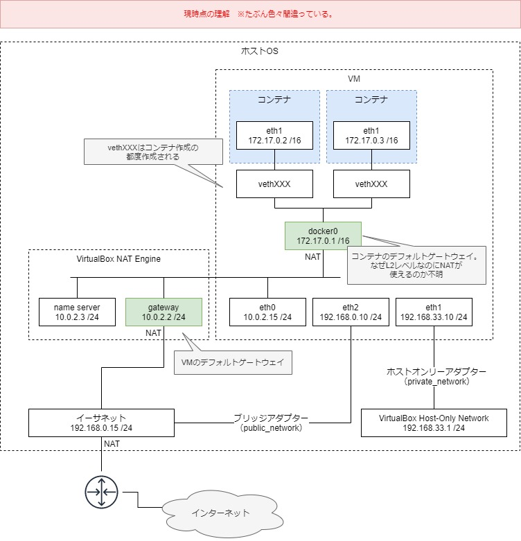

# 4. Dockerネットワーク

- [4-1. 種類](#a1)
- [4-2. 疎通確認](#a2)
  - [4-2-1. 同一ホスト内コンテナ間の疎通確認 ・・・①](#a2-1)
  - [4-2-2. マルチホストコンテナ間の疎通確認 ・・・②](#a2-2)
- [4-3. 検証環境のネットワーク](#a3)
- [4-4. 内部DNSサーバー](#a4)
- [4-5. 参考](#a5)

<span id="a1">

## 4-1. 種類
Dockerのネットワークにはいくつかの種類がある。
- none // ローカルループバックだけ
- host // ホストマシンに直結
- bridge // ホストマシン内ネットワーク
- overlay // 制限なし

```sh
$ docker network ls
NETWORK ID          NAME                DRIVER              SCOPE
a9336aa3dc7f        bridge              bridge              local
ab7720e6c9d4        host                host                local
e5eb9478501f        none                null                local
```

基本的に使うのはbridgeかoverlayだと思う。  
それぞれの説明は以下を参照のこと
- https://qiita.com/TsutomuNakamura/items/ed046ee21caca4a2ffd9 ★
- http://docs.docker.jp/engine/userguide/networking/dockernetworks.html

<span id="a2">

## 4-2. 疎通確認

Dockerネットワークを使ってコンテナ間における疎通確認を行う。
1. 同一ホスト内コンテナ間　・・・①
2. マルチホストコンテナ間　・・・②

確認にはNCコマンドを使った。
- [Appendix. NCコマンドあれこれ](Docker04-1.md)

イメージ
```
VM1                 VM2
    Container_A
    |①
    Container_B ---②--- Container_C
```

※VM1とVM2の間は、VirtualBoxのホストオンリーアダプタ（=Vagrantのprivate_network）で接続。

※pingで疎通確認してもよいが、勉強がてらncで確認してみた。

<span id="a2-1">

### 4-2-1. 同一ホスト内コンテナ間の疎通確認 ・・・①
#### A. デフォルトネットワーク

- コンテナを起動すると、デフォルトでデフォルトネットワーク(bridge)に接続する。

##### 疎通確認
VM1（Container_A）
```sh
# 192.168.33.11
$ docker container run -it --name Container_A centos:centos7 /bin/sh

sh-4.2# hostname -i
172.17.0.2

# sh-4.2#$ yum search nmap-ncat -q
sh-4.2# yum install nmap-ncat -y
```

VM1（Container_B）
```sh
$ docker container run -it --name Container_B centos:centos7 /bin/sh

sh-4.2# hostname -i
172.17.0.3

sh-4.2# yum install nmap-ncat -y

# ポート「11111」で待ち受ける
sh-4.2# nc -ln 172.17.0.3 11111
```

VM1（Container_A）
```sh
# Container_Bのポート「11111」にアクセス
sh-4.2# nc -z 172.17.0.3 11111; echo $?;
0 # OK!
```
- 疎通OK

##### ネットワーク確認
VM1（別ターミナル）
```sh
$ cd /c/vagrant/CentOS7_docker
$ vagrant ssh

# ネットワークの確認
$ docker network ls
NETWORK ID          NAME                DRIVER              SCOPE
afab268bd3b3        bridge              bridge              local # ★デフォルトネットワーク
a7727a3774f9        host                host                local
caa2881f8d36        none                null                local

# Container_A,Bがデフォルトネットワークに入っていることを確認
$ docker inspect bridge | grep Containers -A 15
        "Containers": {
            "59ebbf1893d986659b416514bfec7ca9f391c5ddf24c44a94ee8e66a46041c30": {
                "Name": "Container_B",
                "EndpointID": "938264e9251705b736d6d5886334f459978b2a9453abfd54889355bf3c7f163e",
                "MacAddress": "02:42:ac:11:00:03",
                "IPv4Address": "172.17.0.3/16",
                "IPv6Address": ""
            },
            "5f5164c26a1dd2406f228ea07ae0a4a861db990b1ca47b2cab463670eca1313a": {
                "Name": "Container_A",
                "EndpointID": "166f06b2c9e66a63cc5244c66e17219abf8dc2fe3a4531728b6992b64f6d8bf9",
                "MacAddress": "02:42:ac:11:00:02",
                "IPv4Address": "172.17.0.2/16",
                "IPv6Address": ""
            }
        },

$ docker ps
CONTAINER ID        IMAGE               COMMAND             CREATED              STATUS              PORTS               NAMES
59ebbf1893d9        centos:centos7      "/bin/sh"           About a minute ago   Up About a minute                       Container_B
5f5164c26a1d        centos:centos7      "/bin/sh"           About a minute ago   Up About a minute                       Container_A
```
- デフォルトネットワーク`bridge`にContainer_AとBが入っていることを確認。

##### 疎通確認（ドメイン名、コンテナ名）

VM1（Container_B）
```sh
# 再びポート「11111」で待ち受ける
sh-4.2# nc -lnv 172.17.0.3 11111
```

VM1（Container_A）
```sh
# ドメイン名でアクセスNG
sh-4.2# nc -z 59ebbf1893d9 11111; echo $?;
Ncat: Could not resolve hostname "59ebbf1893d9": Name or service not known. QUITTING.
2 # NG

# コンテナ名でアクセスNG
sh-4.2# nc -z Container_B 11111; echo $?;
Ncat: Could not resolve hostname "Container_B": Name or service not known. QUITTING.
2 # NG
```
- 疎通できない

#### B. ユーザー定義ネットワーク

##### 疎通確認

VM1
```sh
# ユーザー定義ネットワーク作成
$ docker network create --driver bridge testnw

$ docker network ls
NETWORK ID          NAME                DRIVER              SCOPE
afab268bd3b3        bridge              bridge              local
a7727a3774f9        host                host                local
caa2881f8d36        none                null                local
5def524adc0e        test-nw             bridge              local

# コンテナに接続（コメント部分は、コンテナ新規作成時にネットワークにも接続させるコマンド）
$ docker network connect testnw Container_A
#$ docker container run -it --name Container_A --net testnw centos:centos7 /bin/sh

$ docker network connect testnw Cotainer_B
#$ docker container run -it --name Container_B --net testnw centos:centos7 /bin/sh
```
VM1（Container_B）
```sh
sh-4.2# hostname -i
172.21.0.3

# ユーザー定義ネットワークのIPアドレスで待ち受ける
sh-4.2# nc -lnv 172.21.0.3 11111
```

VM1（Container_A）
```sh
# IPアドレス
sh-4.2# nc -z 172.21.0.3 11111; echo $?;
0 # OK!
```

##### ネットワーク確認

```sh
$ docker inspect testnw | grep Containers -A 15
        "Containers": {
            "59ebbf1893d986659b416514bfec7ca9f391c5ddf24c44a94ee8e66a46041c30": {
                "Name": "Container_B",
                "EndpointID": "8adcf489d596bfcf0d76f2de50e2a35cb07d96f1c6119cef01caaff92d848cce",
                "MacAddress": "02:42:ac:15:00:03",
                "IPv4Address": "172.21.0.3/16",
                "IPv6Address": ""
            },
            "5f5164c26a1dd2406f228ea07ae0a4a861db990b1ca47b2cab463670eca1313a": {
                "Name": "Container_A",
                "EndpointID": "83a5ab31914144f26f8933e3b489775be8ec2636f701f2e75411962503cfa5e0",
                "MacAddress": "02:42:ac:15:00:02",
                "IPv4Address": "172.21.0.2/16",
                "IPv6Address": ""
            }
        },
```

##### 疎通確認（ドメイン名、コンテナ名）

VM1（Container_B）
```sh
# 再度立ち上げ（疎通すると落ちてしまうので）
sh-4.2# nc -lnv 172.21.0.3 11111
```

VM1（Container_A）
```sh
# ドメイン名
sh-4.2# nc -z 59ebbf1893d9 11111; echo $?;
0 # OK!
```

VM1（Container_B）
```sh
# 再度立ち上げ（疎通すると落ちてしまうので）
sh-4.2# nc -lnv 172.21.0.3 11111
```

VM1（Container_A）
```sh
# コンテナ名
sh-4.2# nc -z Container_B 11111; echo $?;
0 # OK!
```
参考：
- > デフォルトで用意されているネットワークでは固定IPアドレスオプションが使えないので、
ユーザ定義ネットワークを作成します。  
https://qiita.com/paihu/items/17aa47906dd2bf935a25

- > デフォルトで存在するbridgeという名前のネットワークでは、DNS設定がされていないため名前解決ができません。そのため、コンテナ名を使用したコンテナ間通信ができず、--linkオプションを使用する方法か、コンテナ起動時に自動で割り当てられるプライベートIPアドレスを用いる方法でしか通信できません。それに対し、新規でDockerネットワークを作成すると、DNS設定がされるため名前解決ができ、コンテナ名を使用してコンテナ間で通信ができます。  
https://knowledge.sakura.ad.jp/16082/
- > そのため、同じネットワーク内に接続されているコンテナ同士の通信は、コンテナ名、もしくは「＜コンテナ名＞.＜ネットワーク名＞」というホスト名を使って行えるようになっている。  
https://knowledge.sakura.ad.jp/4786/#

#### C. Docker Composeによるネットワーク

コンテナの立ち上げは、[Docker03.md](Docker03.md) の「4. DockerCompose」のB.C.を参照。

※ ncやpingで疎通確認してもよいが、httpdが入っているのでcurlで疎通確認してみた。

##### 疎通確認

VM1
```sh
$ docker-compose -f docker-compose-scale.yml up -d --scale web=2

$ docker ps
CONTAINER ID        IMAGE               COMMAND              CREATED             STATUS              PORTS                NAMES
05db4427c3c8        httpd               "httpd-foreground"   15 seconds ago      Up 12 seconds       0.0.0.0:80->80/tcp   vagrant_web_1
6ac9a5011c68        httpd               "httpd-foreground"   15 seconds ago      Up 12 seconds       0.0.0.0:81->80/tcp   vagrant_web_2

# ユーザー定義ネットワークが自動で作成されている
$ docker network ls
NETWORK ID          NAME                DRIVER              SCOPE
afab268bd3b3        bridge              bridge              local
a7727a3774f9        host                host                local
caa2881f8d36        none                null                local
8345b6b54929        vagrant_default     bridge              local # ★
```
参考：https://kazuhira-r.hatenablog.com/entry/20170714/1500048645

##### 疎通確認（ドメイン名、コンテナ名）

VM1（vagrant_web_1）
```sh
$ docker exec -it vagrant_web_1 bash

# curlが入っていないのでインストールするが、公式イメージはapt系のOSらしい
root@05db4427c3c8:/usr/local/apache2# apt-get update

root@05db4427c3c8:/usr/local/apache2# apt-get install curl -y > /dev/null

# ドメイン名でアクセスOK!
root@05db4427c3c8:/usr/local/apache2# curl 6ac9a5011c68
<html><body><h1>It works!</h1></body></html>

# コンテナ名でアクセスOK!
root@05db4427c3c8:/usr/local/apache2# curl vagrant_web_2
<html><body><h1>It works!</h1></body></html>
```

<details><summary>もちろんホストマシンからは名前解決できない</summary>

VM1
```sh
$ curl vagrant_web_1
curl: (6) Could not resolve host: vagrant_web_1; Unknown error
$ curl web
curl: (6) Could not resolve host: web; Unknown error
```

</details>

参考：
- > docker-composeで動かしたコンテナは、指定がなければ全てこの仮想ブリッジに接続されており、この際サービス名も名前解決に使われるよう、自動で構成されます。  
https://qiita.com/negineri/items/793f7da3694f819b3b49

##### ネットワーク確認

VM1
```sh
# ユーザー定義ネットワークにコンテナが自動で接続されている
$ docker inspect vagrant_default | grep Containers -A 15
        "Containers": {
            "05db4427c3c8b454c82ff272a3b0c004214a66eda7634fbcf4c21b217d7e8acf": {
                "Name": "vagrant_web_1",
                "EndpointID": "3e11983a8932bd575a0bcdafa203c7ebcf3ef1384e724efd1c03446498653062",
                "MacAddress": "02:42:ac:1a:00:02",
                "IPv4Address": "172.26.0.2/16",
                "IPv6Address": ""
            },
            "6ac9a5011c680c50bd989855a0db4f3558b368f44689c935d8db5add3204a429": {
                "Name": "vagrant_web_2",
                "EndpointID": "5659e2f9810a21e379c27ef3cbf01a1b17aab3e73bb6b43dadebeabbb9cb63d8",
                "MacAddress": "02:42:ac:1a:00:03",
                "IPv4Address": "172.26.0.3/16",
                "IPv6Address": ""
            }
        },
```

<span id="a2-2">

### 4-2-2. マルチホストコンテナ間の疎通確認 ・・・②
#### A. ポートフォワーディング
ホストをまたぐ場合はホストを指定する必要があるのでポートフォワーディングが必要。
##### 疎通確認

VM2（Container_C）
```sh
$ docker container run --rm -it -p 22222:2222 centos:centos7 /bin/sh

$ hostname -i
172.17.0.2

$ yum install nmap-ncat -y

# ポート「11111」で待ち受ける
$ nc -lnv 172.17.0.2 2222
```

VM1（Container_B）
```sh 
$ nc -z 192.168.33.12 22222; echo $?;
0 # OK!
```
<details><summary>ポートフォワーディングなしでは繋がらない</summary>

VM2には疎通できるが、Container_Cには繋がらない
```sh
$ nc 192.168.33.12 22222
Ncat: Connection refused.

$ ping 192.168.33.12
PING 192.168.33.12 (192.168.33.12) 56(84) bytes of data.
64 bytes from 192.168.33.12: icmp_seq=1 ttl=63 time=0.404 ms
```

</details>

#### B. Docker Swarm
後述

<span id="a3">

## 4-3. 検証環境のネットワーク
### A. イメージ
Vagrant + VirtualBoxを使ってDocker環境を作成した場合のイメージ図を示す。  



参考：
- Docker
    - https://knowledge.sakura.ad.jp/23632/
    - https://www.itmedia.co.jp/enterprise/articles/1609/21/news001.html
    - https://qiita.com/osuo/items/16fd61c7479bd7ef041a
- VirtualBox
    - http://zorinos.seesaa.net/article/450304938.html ★
    - https://qiita.com/satoki-shiro/items/9ba6a7b7118b9eab8b8e
    - https://qiita.com/tmiki/items/d786edf221feb4cb1af5
    - https://qiita.com/feifo/items/0fde474005589afcff68

基本的に以下のコマンドで確認した。
- ip a
- ip r
- bridge link

参考：
- https://server.etutsplus.com/centos-7-net-tools-vs-iproute2/
- https://qiita.com/s1061123/items/54c9b4c001877135c4ff


### B. NIC、ルーティングテーブルについて
#### VM側
Dockerをインストールすると、
1) NICに`docker0`が追加される。
    ```sh
    $ ip a
    ・・・
    5: docker0: <NO-CARRIER,BROADCAST,MULTICAST,UP> mtu 1500 qdisc noqueue state DOWN group default # コンテナを１つでも起動した段階でUPになる
        link/ether 02:42:20:b7:30:cf brd ff:ff:ff:ff:ff:ff
        inet 172.17.0.1/16 brd 172.17.255.255 scope global docker0
        valid_lft forever preferred_lft forever
    ```

2) ルーティングテーブルに`docker0`のエントリが追加される。
    ```sh
    $ ip route
    default via 10.0.2.2 dev eth0 proto dhcp metric 100
    default via 192.168.0.1 dev eth2 proto dhcp metric 102
    10.0.2.0/24 dev eth0 proto kernel scope link src 10.0.2.15 metric 100
    172.17.0.0/16 dev docker0 proto kernel scope link src 172.17.0.1 # ★
    192.168.0.0/24 dev eth2 proto kernel scope link src 192.168.0.13 metric 102
    192.168.33.0/24 dev eth1 proto kernel scope link src 192.168.33.11 metric 101
    ```
コンテナ起動すると、
1) vethXXXが追加される。  
※ コンテナを削除したらvethXXXも消えた
    ```sh
    $ ip a
    ---
    7: vethc86712e@if6: <BROADCAST,MULTICAST,UP,LOWER_UP> mtu 1500 qdisc noqueue master docker0 state UP group default
        link/ether 62:94:97:e6:c3:cb brd ff:ff:ff:ff:ff:ff link-netnsid 0
        inet6 fe80::6094:97ff:fee6:c3cb/64 scope link
        valid_lft forever preferred_lft forever
    ```

#### コンテナ側
デフォルトネットワークの場合
```sh
$ ip a
1: lo: <LOOPBACK,UP,LOWER_UP> mtu 65536 qdisc noqueue state UNKNOWN group default qlen 1000
    link/loopback 00:00:00:00:00:00 brd 00:00:00:00:00:00
    inet 127.0.0.1/8 scope host lo
       valid_lft forever preferred_lft forever
6: eth0@if7: <BROADCAST,MULTICAST,UP,LOWER_UP> mtu 1500 qdisc noqueue state UP group default
    link/ether 02:42:ac:11:00:02 brd ff:ff:ff:ff:ff:ff link-netnsid 0 # link-netnsid 0
    inet 172.17.0.2/16 brd 172.17.255.255 scope global eth0
       valid_lft forever preferred_lft forever

$ ip link
1: lo: <LOOPBACK,UP,LOWER_UP> mtu 65536 qdisc noqueue state UNKNOWN mode DEFAULT group default qlen 1000
    link/loopback 00:00:00:00:00:00 brd 00:00:00:00:00:00
6: eth0@if7: <BROADCAST,MULTICAST,UP,LOWER_UP> mtu 1500 qdisc noqueue state UP mode DEFAULT group default
    link/ether 02:42:ac:11:00:02 brd ff:ff:ff:ff:ff:ff link-netnsid 0 # link-netnsid 0

$ ip route
default via 172.17.0.1 dev eth0
172.17.0.0/16 dev eth0 proto kernel scope link src 172.17.0.2
```

### C. 調査に使ったコマンド
- traceroute
    ```sh
    # -I(icmp)なしだと結果が「*」だった。
    $ sudo traceroute -I 8.8.8.8
    ```
    参考：
    - > tracerouteコマンドはUDP（User Datagram Protocol）を使って経路をテストしますが、環境によっては途中にUDPが使用できないかもしれません。このようなときは、「-T」オプションでTCPを使用するか、「-I」オプションでpingコマンドと同じICMP（Internet Control Message Protocol）メッセージのエコー応答（ECHO）を使用します。
    https://www.atmarkit.co.jp/ait/articles/1709/15/news016.html

    - windowsはICMPしかできないみたいなのでオプションなしでもうまくいった
    https://www.atmarkit.co.jp/ait/articles/1709/15/news016.html

- tcpdump
    ```sh
    $ sudo tcpdump -tnl port 53 or 80
    ```

<span id="a4">

## 4-4. 内部DNSサーバー

- ユーザー定義ネットワークを定義すると、Dockerデーモンの内部DNSによって名前解決が行われる。
- この内部DNSサーバーのDNSラウンドロビン機能により、コンテナ間の負荷分散や冗長性を持たせることができる。

resolv.conf
```sh
[root@bec7c72ff13b /]# cat /etc/resolv.conf
search xxx
nameserver 127.0.0.11 # 内部DNSサーバー
options ndots:0
```
参考：http://docs.docker.jp/engine/userguide/networking/configure-dns.html

<span id="a5">

## 4-5. 参考
- 全般：https://www.itmedia.co.jp/enterprise/articles/1609/21/news001.html
- コンテナ間通信：
    - https://knowledge.sakura.ad.jp/16082/#
    - https://knowledge.sakura.ad.jp/23899/#
- マルチホストのコンテナ間通信：https://tech.uzabase.com/entry/2017/08/23/175813