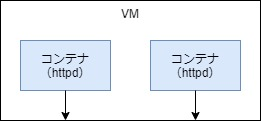
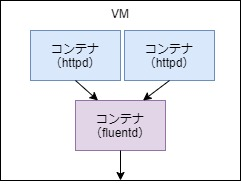
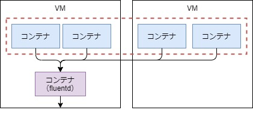

# 5. Dockerログ

- [5-1. json-file](#a1)
- [5-2. fluentd](#a2)
- [5-3. 参考](#a3)

Dockerのログ周りの設定を記載する。

基礎知識
- > Apache HTTP Server（httpd）イメージがその代表で、このイメージではWebサーバーへのアクセスログが標準出力に出力されるよう設定されている
- > 独自にコンテナを作成する場合、コンテナ内にログを記録するとコンテナの削除時にそのデータは消滅してしまう。また、コンテナ内からコンテナ外にデータを取り出す際にも一手間かかってしまう。httpdコンテナの場合と同様、標準出力にログを出力し、Dockerのログ機構を利用すればこの問題は容易に解決できる。複数の種類のログを出力するような場合は対応できないため、その場合は別途ログ出力機構を用意する必要はあるが、多くのケースでは単一のログ出力で十分だろう。

Dockerのログ出力はLoging Driverによって制御されており10種類ほど存在するが、以下では`json-file`と`fluentd`について記載する。

<span id="a1">

## 5-1. json-file
### A. 単純な例
json-fileは名前の通りjson形式の文字列をログファイルに書き込む。

この設定はデフォルトの設定で、コンテナを削除するとログも削除される。

VM
```sh
# コンテナ起動
$ docker run -d -p 80:80 --name test httpd
```

WSL
```sh
# VMのIPアドレスにアクセス
$ curl 192.168.33.11
```
VM
```sh
# ログ確認（コマンド）
$ docker logs test -f
192.168.33.1 - - [25/May/2020:05:36:50 +0000] "GET / HTTP/1.1" 200 45
192.168.33.1 - - [25/May/2020:05:36:50 +0000] "GET / HTTP/1.1" 200 45
192.168.33.1 - - [25/May/2020:05:36:50 +0000] "GET / HTTP/1.1" 200 45
192.168.33.1 - - [25/May/2020:05:36:51 +0000] "GET / HTTP/1.1" 200 45

# コンテナIDの確認
$ docker ps --no-trunc
CONTAINER ID                                                       IMAGE               COMMAND              CREATED             STATUS              PORTS                NAMES
3c368c880b553c501d5bbc0ccf7e4ba412ea73fb0c2b96b89cead1223fa82ce9   httpd               "httpd-foreground"   8 minutes ago       Up 8 minutes        0.0.0.0:80->80/tcp   test

# ログファイルの確認
$ sudo tail /var/lib/docker/containers/3c368c880b553c501d5bbc0ccf7e4ba412ea73fb0c2b96b89cead1223fa82ce9/3c368c880b553c501d5bbc0ccf7e4ba412ea73fb0c2b96b89cead1223fa82ce9-json.log
{"log":"192.168.33.1 - - [25/May/2020:05:36:50 +0000] \"GET / HTTP/1.1\" 200 45\n","stream":"stdout","time":"2020-05-25T05:36:50.173246061Z"}
{"log":"192.168.33.1 - - [25/May/2020:05:36:50 +0000] \"GET / HTTP/1.1\" 200 45\n","stream":"stdout","time":"2020-05-25T05:36:50.397279225Z"}
```
- ログファイル名は、コンテナIDで特定する。

### B. 複数コンテナ

次は２つのコンテナを起動した場合を確認する。  
また、ログ出力内容に付加情報を追加してみる。



```sh
# コンテナ起動
$ docker run -d -p 80:80 --name test1 --log-opt tag="docker.{{.Name}}" httpd
$ docker run -d -p 81:80 --name test2 --log-opt tag="docker.{{.Name}}" httpd
```

WSL
```sh
# VMのIPアドレスにアクセス
$ curl 192.168.33.11
$ curl 192.168.33.11:81
$ curl 192.168.33.11
```

VM
```sh
# ログ確認（コマンド）
$ docker logs -f test1
192.168.33.1 - - [26/May/2020:00:48:43 +0000] "GET / HTTP/1.1" 200 45
192.168.33.1 - - [26/May/2020:00:48:45 +0000] "GET / HTTP/1.1" 200 45

$ docker logs -f test2
192.168.33.1 - - [26/May/2020:00:49:25 +0000] "GET / HTTP/1.1" 200 45

# コンテナIDの確認
$ docker ps --no-trunc -q
452f17916c9819c2dee638f9d079b20d318bcd06f4022153d25788ab11f50850
2f0e70c3e7e7617eaefa442ed9e4d5c0f7b540e24687adbbfe4b00fa7bdddeb2

$ sudo su

# ログファイルの確認
[root@docker1 vagrant]# tail /var/lib/docker/containers/2f0e70c3e7e7617eaefa442ed9e4d5c0f7b540e24687adbbfe4b00fa7bdddeb2/2f0e70c3e7e7617eaefa442ed9e4d5c0f7b540e24687adbbfe4b00fa7bdddeb2-json.log
{"log":"192.168.33.1 - - [26/May/2020:00:48:43 +0000] \"GET / HTTP/1.1\" 200 45\n","stream":"stdout","attrs":{"tag":"docker.test1"},"time":"2020-05-26T00:48:43.572250821Z"}
{"log":"192.168.33.1 - - [26/May/2020:00:48:45 +0000] \"GET / HTTP/1.1\" 200 45\n","stream":"stdout","attrs":{"tag":"docker.test1"},"time":"2020-05-26T00:48:45.783095441Z"}

[root@docker1 vagrant]# tail /var/lib/docker/containers/452f17916c9819c2dee638f9d079b20d318bcd06f4022153d25788ab11f50850/452f17916c9819c2dee638f9d079b20d318bcd06f4022153d25788ab11f50850-json.log
{"log":"192.168.33.1 - - [26/May/2020:00:49:25 +0000] \"GET / HTTP/1.1\" 200 45\n","stream":"stdout","attrs":{"tag":"docker.test2"},"time":"2020-05-26T00:49:25.441608729Z"}
```

<span id="a2">

## 5-2. fluentd

### 5-2-1. 同一ホストの例

fluentdのコンテナを起動し、アプリケーションのコンテナのログをfluentdコンテナにログを転送することで、ログを1つのファイルに集約できる。

この場合、コンテナを削除してもホストマシンにログが残る。

 

VM
```sh
# fluentdコンテナ起動
# VMの「/var/fluentd」に出力する
$ docker run -d -p 24224:24224 -v /var/fluentd:/fluentd/log fluent/fluentd

# アプリ用コンテナを起動（１つ目）
$ docker run -d -p 80:80 --name test1 --log-driver=fluentd --log-opt fluentd-address=192.168.33.11:24224 --log-opt tag="docker.{{.Name}}" httpd

# アプリ用コンテナを起動（２つ目）
$ docker run -d -p 81:80 --name test2 --log-driver=fluentd --log-opt fluentd-address=192.168.33.11:24224 --log-opt tag="docker.{{.Name}}" httpd
```
- `log`,`log-opt`オプションでfluentdコンテナで処理することを指定。
- `tag`オプションで出力ログにタグ内容を付与できる。今回の例では固定文字「docker」にコンテナ名(.Name)を付与。

WSL
```sh
$ curl 192.168.33.11:80
$ curl 192.168.33.11:81
$ curl 192.168.33.11:80
```

VM
```sh
# ログ確認（コマンド）-> エラー。fluentdはdocker logsに対応していない模様。
$ docker logs -f test1
Error response from daemon: configured logging driver does not support reading

# コンテナIDの確認
$ docker ps
CONTAINER ID        IMAGE               COMMAND                  CREATED             STATUS              PORTS                                NAMES
afb4a06a0d46        httpd               "httpd-foreground"       2 minutes ago       Up 2 minutes        0.0.0.0:81->80/tcp                   test2
d24c1f05ebfb        httpd               "httpd-foreground"       2 minutes ago       Up 2 minutes        0.0.0.0:80->80/tcp                   test1
e75dc137ed5f        fluent/fluentd      "/bin/entrypoint.sh …"   2 minutes ago       Up 2 minutes        5140/tcp, 0.0.0.0:24224->24224/tcp   vigorous_nobel

# ログファイルの確認　２列目にコンテナ名が出力されている
$ tail -f /var/fluentd/docker.b5a682cc1ba21bed6cdc05fdce870a21c.log
2020-05-26T01:16:50+00:00       docker.test1    {"container_id":"d24c1f05ebfbc43cfef7671a4bcc351f19a20f4b1583bb98b783eb609fc9055c","container_name":"/test1","source":"stdout","log":"192.168.33.1 - - [26/May/2020:01:16:50 +0000] \"GET / HTTP/1.1\" 200 45"}
2020-05-26T01:16:51+00:00       docker.test2    {"container_id":"afb4a06a0d462b491e59d013f6a094e18cadd0f73d9da49de081c0aaa2783848","container_name":"/test2","source":"stdout","log":"192.168.33.1 - - [26/May/2020:01:16:51 +0000] \"GET / HTTP/1.1\" 200 45"}
2020-05-26T01:16:52+00:00       docker.test1    {"log":"192.168.33.1 - - [26/May/2020:01:16:52 +0000] \"GET / HTTP/1.1\" 200 45","container_id":"d24c1f05ebfbc43cfef7671a4bcc351f19a20f4b1583bb98b783eb609fc9055c","container_name":"/test1","source":"stdout"}

```

### 5-2-2. fluentdコンテナの設定を見てみる
flutned.conf
```sh
$ docker exec -it e75 sh

/ # cat /fluentd/etc/fluent.conf
<source>
  @type  forward
  @id    input1
  @label @mainstream
  port  24224
</source>

<filter **>
  @type stdout
</filter>

<label @mainstream>
  <match docker.**>
    @type file
    @id   output_docker1
    path         /fluentd/log/docker.*.log
    symlink_path /fluentd/log/docker.log
    append       true
    time_slice_format %Y%m%d
    time_slice_wait   1m
    time_format       %Y%m%dT%H%M%S%z
  </match>
  <match **>
    @type file
    @id   output1
    path         /fluentd/log/data.*.log
    symlink_path /fluentd/log/data.log # ★
    append       true
    time_slice_format %Y%m%d
    time_slice_wait   10m
    time_format       %Y%m%dT%H%M%S%z
  </match>
</label>
```
ログファイル
```sh
# コンテナ側
/ # ls -l /fluentd/log/
total 28
-rw-r--r--    1 fluent   fluent       13953 May 26 01:13 docker.20200525.log
-rw-r--r--    1 fluent   fluent        4355 May 26 01:16 docker.b5a682cc1ba21bed6cdc05fdce870a21c.log # ★
-rw-r--r--    1 fluent   fluent          68 May 26 01:16 docker.b5a682cc1ba21bed6cdc05fdce870a21c.log.meta
lrwxrwxrwx    1 fluent   fluent          57 May 26 01:13 docker.log -> /fluentd/log/docker.b5a682cc1ba21bed6cdc05fdce870a21c.log

/ # exit

# VM(ホスト)側
$ ls -l /var/fluentd/
total 28
-rw-r--r--. 1 vagrant vagrant 13953 May 26 10:13 docker.20200525.log
-rw-r--r--. 1 vagrant vagrant  4355 May 26 10:16 docker.b5a682cc1ba21bed6cdc05fdce870a21c.log # ★
-rw-r--r--. 1 vagrant vagrant    68 May 26 10:16 docker.b5a682cc1ba21bed6cdc05fdce870a21c.log.meta
lrwxrwxrwx. 1 vagrant vagrant    57 May 26 10:13 docker.log -> /fluentd/log/docker.b5a682cc1ba21bed6cdc05fdce870a21c.log
```
- `docker run -v`の通りボリュームがマウントされている。（コンテナ側とホスト側で同じ内容）

### 5-2-3. マルチホストの例



※可用性を考慮すると、fluentdコンテナとアプリ用コンテナは別ホストで運用するのが望ましいと思われる

前提：
- [4-1. 負荷分散の確認](../load_dist/LB04.md#a1)の`A.クラスタの作成`、`B.ネットワークの作成`を実施済み
- VM1,VM2を起動済み

VM1
```sh
# fluentdコンテナの起動
$ docker run -d -p 24224:24224 -v /var/fluentd:/fluentd/log fluent/fluentd

# サービスの作成
$ docker service create --name test01 --network mynet01 -p 8080:80 --replicas=4 --log-driver=fluentd --log-opt fluentd-address=192.168.33.11:24224 --log-opt tag="docker.{{.Name}}" larsks/thttpd

$ tail -f /var/fluentd/docker.b5a672a7f15755374a77c6703e565b97c.log
2020-05-25T08:57:41+00:00       docker.test01.1.jo0dlleqhh8lu4rmfr6ie3hya       {"log":"10.0.0.2 - - [25/May/2020:08:57:41 +0000] \"GET / HTTP/1.1\" 200 1351 \"\" \"curl/7.58.0\"","container_id":"c7eb50f0f3093022a9639f40e4b76fc82e6157bf2e0539b98a609f8825f830f7","container_name":"/test01.1.jo0dlleqhh8lu4rmfr6ie3hya","source":"stderr"}
2020-05-25T08:57:41+00:00       docker.test01.3.1h5kayaf8udrg767ebfl8q2kg       {"container_id":"411a8178fb4e25936a61872473bdb5536eb34d1f174039239cfa84db0683a0bc","container_name":"/test01.3.1h5kayaf8udrg767ebfl8q2kg","source":"stderr","log":"10.0.0.2 - - [25/May/2020:08:57:41 +0000] \"GET / HTTP/1.1\" 200 1351 \"\" \"curl/7.58.0\""}
2020-05-25T08:48:51+00:00       docker.test01.2.q2lxcwnfy808yiexb8o4le4z3       {"container_id":"bfebd1f164cf47d84baae2e6044a8bfe46c156adf688f90f6d1246638768783b","container_name":"/test01.2.q2lxcwnfy808yiexb8o4le4z3","source":"stderr","log":"10.0.0.2 - - [25/May/2020:08:48:51 +0000] \"GET / HTTP/1.1\" 200 1351 \"\" \"curl/7.58.0\""}
2020-05-25T08:48:52+00:00       docker.test01.4.9b49bfgn8stky9dvtzei8xdtw       {"container_name":"/test01.4.9b49bfgn8stky9dvtzei8xdtw","source":"stderr","log":"10.0.0.2 - - [25/May/2020:08:48:52 +0000] \"GET / HTTP/1.1\" 200 1351 \"\" \"curl/7.58.0\"","container_id":"dd3196c5a216e4174525a0c5021d5c7ffbd006dd1af4643932bfd12ea90a96d1"}
```

<span id="a3">

## 5-3. 参考
https://knowledge.sakura.ad.jp/6752/