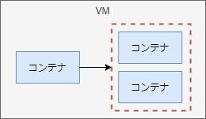

# 1. 負荷分散（同一ホスト内）

- [0. 準備（1-1,1-2共通）](#a0)
- [1. docker run --net-alias](#a1)
- [2. docker network connect --alias](#a2)
- [3. docker-compose up --scale](#a3)

ここでは負荷分散の例を記載していく。
以下の３パターンが考えられるが、
- 同一ホスト内（DNSラウンドロビン）
- マルチホスト間（LVS）
- マルチホスト間（オーバーレイネットワーク）

当ページでは「同一ホスト内（DNSラウンドロビン）」について記載する。

DockerのDNSラウンドロビン機能を使って、以下の赤枠内で処理の負荷分散をさせる。



<span id="a0">

## 0. 準備（1-1,1-2共通）
```sh
# DockerFile
$ vi Dockerfile
FROM centos:centos7

RUN yum install httpd bind-utils -y

ARG NUM=1
COPY file/index_$NUM.html /var/www/html/index.html

EXPOSE 80

ENTRYPOINT ["/usr/sbin/httpd", "-DFOREGROUND"]

# HTMLファイル用意
$ mkdir file
$ echo 'This is test1.' > file/index_1.html
$ echo 'This is test2.' > file/index_2.html
$ echo 'This is test3.' > file/index_3.html

# ビルド
$ docker build . --build-arg NUM=1 -t lb-test1
$ docker build . --build-arg NUM=2 -t lb-test2
$ docker build . --build-arg NUM=3 -t lb-test3

# 確認
$ docker image ls | head
lb-test3            latest              5ce44cddb225        4 seconds ago       314MB
lb-test2            latest              c535686daeba        9 seconds ago       314MB
lb-test1            latest              445b63bc32ce        11 seconds ago      314MB

# ユーザー定義ネットワーク作成
$ docker network create -d bridge lbnw-test
```

<span id="a1">

## 1. docker run --net-alias

コンテナ作成
```sh
$ docker run -d --name test1 --net-alias aaa --net lbnw-test lb-test1
$ docker run -d --name test2 --net-alias aaa --net lbnw-test lb-test2
$ docker run -d --name test3 --net lbnw-test lb-test3
```
- コンテナtest3にて`curl aaa`を実行して確認する。
- コンテナtest3にはエイリアスを登録しない。登録するとなぜか必ず自身にアクセスしてしまうため  
（digの結果が無視される？模様）

確認
```sh
$ docker exec -it test3 bash

# ラウンドロビンというものの必ずしも順番ではないのは不明だが、分散はされている
[root@731d70705dff /]# curl aaa
This is test1.
[root@731d70705dff /]# curl aaa
This is test2.
[root@731d70705dff /]# curl aaa
This is test1.
[root@731d70705dff /]# curl aaa
This is test1.
```
<details><summary>補足</summary>

```sh
# Digでも確認
[root@731d70705dff /]# yum install bind-utils -y

# [root@731d70705dff /]# dig aaa a +short
[root@731d70705dff /]# dig aaa | grep ';; ANSWER' -A3
;; ANSWER SECTION:
aaa.                    600     IN      A       172.23.0.3
aaa.                    600     IN      A       172.23.0.2

[root@731d70705dff /]# exit

$ docker inspect test1 | grep '"lbnw-test":' -A6
                "lbnw-test": {
                    "IPAMConfig": null,
                    "Links": null,
                    "Aliases": [
                        "aaa", # ★
                        "4555012c44c4"
                    ],
$ docker inspect test2 | grep '"lbnw-test":' -A6
                "lbnw-test": {
                    "IPAMConfig": null,
                    "Links": null,
                    "Aliases": [
                        "aaa", # ★
                        "2260bf3f2bd1"
                    ],
$ docker inspect test3 | grep '"lbnw-test":' -A6
                "lbnw-test": {
                    "IPAMConfig": null,
                    "Links": null,
                    "Aliases": [
                        "731d70705dff"
                    ],
                    "NetworkID": "4d35aee38dab8d379087999453a3f230bf9d9af164babb8f96b197f1d211eb47",

# 削除
$ docker rm test1 test2 test3 -f
```

</details>

参考：
- > もしサービスとして複数のコンテナを実行する場合は、ブリッジネットワーク内で自動的にアクセスの負荷分散（ラウンドロビン方式）が処理されます。
https://knowledge.sakura.ad.jp/23632/
- https://qiita.com/muk-ai/items/7a0b554d90a8aad44b95
- https://docs.docker.com/engine/reference/commandline/create/

<span id="a2">

## 2. docker network connect --alias

docker networkコマンドのaliasオプションを使用しても、Aと同じ結果が得られる。

コンテナ作成
```sh
$ docker run -d --name test1 lb-test1
$ docker run -d --name test2 lb-test2
$ docker run -d --name test3 lb-test3
$ docker network connect --alias bbb lbnw-test test1
$ docker network connect --alias bbb lbnw-test test2
$ docker network connect lbnw-test test3
```
- コンテナtest3にて`curl aaa`を実行して確認する。
- コンテナtest3にはエイリアスを登録しない。登録するとなぜか必ず自身にアクセスしてしまうため  
（digの結果が無視される？模様）

確認
```sh
$ docker exec -it test3 bash

[root@1b8565f98e43 /]# curl bbb
This is test2.
[root@1b8565f98e43 /]# curl bbb
This is test1.
[root@1b8565f98e43 /]# curl bbb
This is test1.
```

<details><summary>補足</summary>

```sh
[root@1b8565f98e43 /]# yum install bind-utils -y

[root@1b8565f98e43 /]# dig bbb +short
[root@1b8565f98e43 /]# dig bbb | grep ';; ANSWER' -A3
;; ANSWER SECTION:
bbb.                    600     IN      A       172.23.0.2
bbb.                    600     IN      A       172.23.0.3

[root@1b8565f98e43 /]# exit

$ docker inspect test1 | grep lbnw-test -A6
                "lbnw-test": {
                    "IPAMConfig": {},
                    "Links": null,
                    "Aliases": [
                        "bbb",
                        "19cff7c95445"
                    ],
$ docker inspect test2 | grep lbnw-test -A6
                "lbnw-test": {
                    "IPAMConfig": {},
                    "Links": null,
                    "Aliases": [
                        "bbb",
                        "541952d99eeb"
                    ],
$ docker inspect test3 | grep lbnw-test -A6
                "lbnw-test": {
                    "IPAMConfig": {},
                    "Links": null,
                    "Aliases": [
                        "1b8565f98e43"
                    ],
                    "NetworkID": "4d35aee38dab8d379087999453a3f230bf9d9af164babb8f96b197f1d211eb47",

# 削除
$ docker rm test1 test2 test3 -f
```
</details>

<span id="a3">

## 3. docker-compose up --scale
```sh
$ vi docker-compose-lb.yml
version: '3.7'
services:
  web:
    image: httpd
  client:
    image: centos:centos7
    tty: true

$ docker-compose -f docker-compose-lb.yml up -d --scale web=2
Creating network "vagrant_default" with the default driver # 自動作成されたユーザー定義ネットワーク。ネットワーク名をメモしておく。
Recreating vagrant_client_1 ... done
Creating vagrant_web_1      ... done
Creating vagrant_web_2      ... done

# web 1台目のhtmlファイルを修正
$ docker exec -it vagrant_web_1 bash

root@6a6bead7083b:/usr/local/apache2# cat /etc/os-release | head -1
PRETTY_NAME="Debian GNU/Linux 10 (buster)"

# debianなのでapt-getを使う
root@6a6bead7083b:/usr/local/apache2# apt-get update >/dev/null 2>&1 && apt-get install vim -y >/dev/null 2>&1

root@6a6bead7083b:/usr/local/apache2# vim htdocs/index.html
<html><body><h1>This is test1.</h1></body></html>

root@6a6bead7083b:/usr/local/apache2# exit

# web 2台目のhtmlファイルを修正
$ docker exec -it vagrant_web_2 bash

root@3f1a67b165c2:/usr/local/apache2# apt-get update >/dev/null 2>&1 && apt-get install vim -y >/dev/null 2>&1

root@3f1a67b165c2:/usr/local/apache2# vim htdocs/index.html
<html><body><h1>This is test2.</h1></body></html>

root@3f1a67b165c2:/usr/local/apache2# exit

# 確認
$ docker exec -it vagrant_client_1 bash
[root@bec7c72ff13b /]# curl web
<html><body><h1>This is test1.</h1></body></html>
[root@bec7c72ff13b /]# curl web
<html><body><h1>This is test1.</h1></body></html>
[root@bec7c72ff13b /]# curl web
<html><body><h1>This is test2.</h1></body></html>
[root@bec7c72ff13b /]# curl web
```
<details><summary>補足</summary>

```sh
[root@bec7c72ff13b /]# yum install bind-utils -y

# [root@bec7c72ff13b /]# dig web +short
[root@bec7c72ff13b /]# dig web | grep ';; ANSWER' -A3
;; ANSWER SECTION:
web.                    600     IN      A       172.29.0.4
web.                    600     IN      A       172.29.0.2

[root@bec7c72ff13b /]# exit

$ docker ps
CONTAINER ID        IMAGE               COMMAND              CREATED             STATUS              PORTS               NAMES
bec7c72ff13b        centos:centos7      "/bin/bash"          36 minutes ago      Up 36 minutes                           vagrant_client_1
6a6bead7083b        httpd               "httpd-foreground"   36 minutes ago      Up 36 minutes       80/tcp              vagrant_web_1
3f1a67b165c2        httpd               "httpd-foreground"   36 minutes ago      Up 36 minutes       80/tcp              vagrant_web_2

$ docker inspect vagrant_web_1 | grep '"vagrant_default":' -A6
                "vagrant_default": {
                    "IPAMConfig": null,
                    "Links": null,
                    "Aliases": [
                        "6a6bead7083b",
                        "web" # ★
                    ],
$ docker inspect vagrant_web_2 | grep '"vagrant_default":' -A6
                "vagrant_default": {
                    "IPAMConfig": null,
                    "Links": null,
                    "Aliases": [
                        "3f1a67b165c2",
                        "web" # ★
                    ],
$ docker inspect vagrant_client_1 | grep '"vagrant_default":' -A6
                "vagrant_default": {
                    "IPAMConfig": null,
                    "Links": null,
                    "Aliases": [
                        "client",
                        "bec7c72ff13b"
                    ],
```
</details>

参考：
- docker-compose: https://christina04.hatenablog.com/entry/docker-service-discovery
- tty: https://qiita.com/sekitaka_1214/items/2af73d5dc56c6af8a167