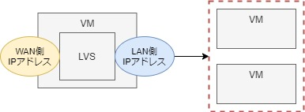

# 2. 負荷分散（マルチホスト間(LVS)）

- [2-1. LVSの導入](#a1)
- [2-2. 配下サーバーの設定](#a2)
- [2-3. 補足](#a3)
- [2-4. 参考](#a4)

VMにLVSというロードバランサー機能を持つソフトを導入し、マルチホスト間で負荷分散を実現する。  

LVSでは、「NAT」「ダイレクトルーティング」「トンネリング」の３つの方式があるが、今回はNAT利用する。



ポイントは、LVSを導入するサーバーでは以下の2種類のIPアドレスを用意すること。
- リクエストを受けるIPアドレス // WAN側IPアドレス
- そのリクエストを振り分けるためのIPアドレス // LAN側IPアドレス

このWAN側・LAN側IPアドレスの変換をLVSのNAT機能が行ってくれる。

<span id="a1">

## 2-1. LVSの導入
### A. VMの設定
vagrantの`public_network`を設定してVMを立ち上げる。
```sh
$ vi Vagrantfile
Vagrant.configure("2") do |config|
  config.vm.box = "centos/7"
  config.vm.hostname = "lvs1"
  config.vm.network "forwarded_port", guest: 80, host: 8080
  config.vm.network "private_network", ip: "192.168.33.10"
  config.vm.network "public_network", i: "192.168.0.100" # ★
  config.vm.synced_folder ".", "/vagrant_data"

  config.vm.provider "virtualbox" do |vb|
    vb.gui = true
  end

  config.vm.provision "shell", inline: <<-SHELL
    sudo ln -sf /usr/share/zoneinfo/Asia/Tokyo /etc/localtime
  SHELL
end

$ vagrant up
$ vagrant ssh
```

<details><summary>設定確認</summary>

```sh
$ ip a | egrep ': |inet '
1: lo: <LOOPBACK,UP,LOWER_UP> mtu 65536 qdisc noqueue state UNKNOWN group default qlen 1000
    inet 127.0.0.1/8 scope host lo
2: eth0: <BROADCAST,MULTICAST,UP,LOWER_UP> mtu 1500 qdisc pfifo_fast state UP group default qlen 1000
    inet 10.0.2.15/24 brd 10.0.2.255 scope global noprefixroute dynamic eth0
3: eth1: <BROADCAST,MULTICAST,UP,LOWER_UP> mtu 1500 qdisc pfifo_fast state UP group default qlen 1000
    inet 192.168.33.10/24 brd 192.168.33.255 scope global noprefixroute eth1 # LAN側
4: eth2: <BROADCAST,MULTICAST,UP,LOWER_UP> mtu 1500 qdisc pfifo_fast state UP group default qlen 1000
    inet 192.168.0.19/24 brd 192.168.0.255 scope global noprefixroute dynamic eth2 # WAN側

1: lo: <LOOPBACK,UP,LOWER_UP> mtu 65536 qdisc noqueue state UNKNOWN group default qlen 1000
    link/loopback 00:00:00:00:00:00 brd 00:00:00:00:00:00
    inet 127.0.0.1/8 scope host lo
       valid_lft forever preferred_lft forever
    inet6 ::1/128 scope host
       valid_lft forever preferred_lft forever
2: eth0: <BROADCAST,MULTICAST,UP,LOWER_UP> mtu 1500 qdisc pfifo_fast state UP group default qlen 1000
    link/ether 52:54:00:26:10:60 brd ff:ff:ff:ff:ff:ff
    inet 10.0.2.15/24 brd 10.0.2.255 scope global noprefixroute dynamic eth0
       valid_lft 86376sec preferred_lft 86376sec
    inet6 fe80::5054:ff:fe26:1060/64 scope link
       valid_lft forever preferred_lft forever
3: eth1: <BROADCAST,MULTICAST,UP,LOWER_UP> mtu 1500 qdisc pfifo_fast state UP group default qlen 1000
    link/ether 08:00:27:81:e1:7b brd ff:ff:ff:ff:ff:ff
    inet 192.168.33.10/24 brd 192.168.33.255 scope global noprefixroute eth1
       valid_lft forever preferred_lft forever
    inet6 fe80::a00:27ff:fe81:e17b/64 scope link
       valid_lft forever preferred_lft forever
4: eth2: <BROADCAST,MULTICAST,UP,LOWER_UP> mtu 1500 qdisc pfifo_fast state UP group default qlen 1000
    link/ether 08:00:27:f2:89:c1 brd ff:ff:ff:ff:ff:ff
    inet 192.168.0.100/24 brd 192.168.0.255 scope global noprefixroute eth2
       valid_lft forever preferred_lft forever
    inet6 fe80::a00:27ff:fef2:89c1/64 scope link
       valid_lft forever preferred_lft forever


$ ip r
default via 10.0.2.2 dev eth0 proto dhcp metric 100
default via 192.168.0.1 dev eth2 proto dhcp metric 102
10.0.2.0/24 dev eth0 proto kernel scope link src 10.0.2.15 metric 100
192.168.0.0/24 dev eth2 proto kernel scope link src 192.168.0.19 metric 102
192.168.33.0/24 dev eth1 proto kernel scope link src 192.168.33.10 metric 101

default via 10.0.2.2 dev eth0 proto dhcp metric 100
10.0.2.0/24 dev eth0 proto kernel scope link src 10.0.2.15 metric 100
192.168.0.0/24 dev eth2 proto kernel scope link src 192.168.0.100 metric 102
192.168.33.0/24 dev eth1 proto kernel scope link src 192.168.33.10 metric 101
```
</details>

### B. ネットワークの設定
```sh
# ネットワーク設定
$ sudo vi /etc/sysctl.conf
net.ipv4.ip_forward = 1 # 1に変更

$ sudo /sbin/sysctl -p
```

### C. ipvsadmの導入
LVSでは「ipvsadm」というコマンドを使用してロードバランサの設定を行う。
```sh
# 解析のためnmap-ncatとiprouteも入れておく
$ sudo yum install ipvsadm nmap-ncat iproute -y

$ sudo ipvsadm -v
ipvsadm v1.27 2008/5/15 (compiled with popt and IPVS v1.2.1)

# 念のため初期化
$ sudo ipvsadm -C

# WAN側IPアドレスの登録
$ sudo ipvsadm -A -t 192.168.0.100:80

# 振り分け先IPアドレスの登録
$ sudo ipvsadm -a -t 192.168.0.100:80 -r 192.168.33.11:80 -m
$ sudo ipvsadm -a -t 192.168.0.100:80 -r 192.168.33.12:80 -m

# 確認
$ sudo ipvsadm -ln
IP Virtual Server version 1.2.1 (size=4096)
Prot LocalAddress:Port Scheduler Flags
  -> RemoteAddress:Port           Forward Weight ActiveConn InActConn
TCP  192.168.0.100:80 wlc
  -> 192.168.33.11:80             Masq    1      0          0
  -> 192.168.33.12:80             Masq    1      0          0
```

<span id="a2">

## 2-2. 配下サーバーの設定

まずは配下サーバーは1台だけで試すのもあり。

### A. VMの設定
`private_network`のipは2台で同一にならないようずらすこと。
```sh
$ vi Vagrantfile
Vagrant.configure("2") do |config|
  config.vm.box = "centos/7"
  config.vm.hostname = "docker1"
  config.vm.network "forwarded_port", guest: 80, host: 8080
  config.vm.network "private_network", ip: "192.168.33.11"
  #config.vm.network "public_network", i: "192.168.0.100" # publicは不要
  config.vm.synced_folder ".", "/vagrant_data"

  config.vm.provider "virtualbox" do |vb|
    vb.gui = true
  end

  config.vm.provision "shell", inline: <<-SHELL
    sudo ln -sf /usr/share/zoneinfo/Asia/Tokyo /etc/localtime
  SHELL
end

$ vagrant up
$ vagrant ssh
```
<details><summary>設定確認</summary>

```sh
# 192.168.33.11/24
# NAT方式を使うのでPublic Networkのipは割り当てない。
$  ip a | egrep ': |inet '
1: lo: <LOOPBACK,UP,LOWER_UP> mtu 65536 qdisc noqueue state UNKNOWN group default qlen 1000
    inet 127.0.0.1/8 scope host lo
2: eth0: <BROADCAST,MULTICAST,UP,LOWER_UP> mtu 1500 qdisc pfifo_fast state UP group default qlen 1000
    inet 10.0.2.15/24 brd 10.0.2.255 scope global noprefixroute dynamic eth0
3: docker0: <NO-CARRIER,BROADCAST,MULTICAST,UP> mtu 1500 qdisc noqueue state DOWN group default
    inet 172.17.0.1/16 brd 172.17.255.255 scope global docker0
4: eth1: <BROADCAST,MULTICAST,UP,LOWER_UP> mtu 1500 qdisc pfifo_fast state UP group default qlen 1000
    inet 192.168.33.11/24 brd 192.168.33.255 scope global noprefixroute eth1


1: lo: <LOOPBACK,UP,LOWER_UP> mtu 65536 qdisc noqueue state UNKNOWN group default qlen 1000
    inet 127.0.0.1/8 scope host lo
2: eth0: <BROADCAST,MULTICAST,UP,LOWER_UP> mtu 1500 qdisc pfifo_fast state UP group default qlen 1000
    inet 10.0.2.15/24 brd 10.0.2.255 scope global noprefixroute dynamic eth0
3: eth1: <BROADCAST,MULTICAST,UP,LOWER_UP> mtu 1500 qdisc pfifo_fast state UP group default qlen 1000
    inet 192.168.33.11/24 brd 192.168.33.255 scope global noprefixroute eth1

$ ip r
default via 10.0.2.2 dev eth0 proto dhcp metric 100
10.0.2.0/24 dev eth0 proto kernel scope link src 10.0.2.15 metric 100
192.168.33.0/24 dev eth1 proto kernel scope link src 192.168.33.11 metric 101
```
</details>

### B. httpdのインストール
```sh
$ sudo yum install httpd -y
$ sudo systemctl start httpd

# 配下サーバーのどちらにアクセスしたかわかるよう、VMごとに異なる文言を設定する
$ sudo sh -c "echo '<html><h1>Hello Docker1</h1></html>' > /var/www/html/index.html"
```

### C. ルーティングテーブルにエントリを追加
```sh
# ルーティングテーブルに経路を追加 (※1)
$ sudo vi /etc/sysconfig/network-scripts/route-eth1
192.168.0.0/24 dev eth1 via 192.168.33.10
# WAN側のネットワーク(192.168.0.0)に送信する場合は、LAN側のIP(192.168.33.10)にeth1経由で送る

$ sudo systemctl restart network

# ipコマンドでもできるがリブートすると戻ってしまう
# $ sudo ip route add 192.168.0.0/24 dev eth1 via 192.168.33.10

$ ip r
default via 10.0.2.2 dev eth0 proto dhcp metric 100
10.0.2.0/24 dev eth0 proto kernel scope link src 10.0.2.15 metric 100
172.17.0.0/16 dev docker0 proto kernel scope link src 172.17.0.1
192.168.0.0/24 via 192.168.33.10 dev eth1 # ★
192.168.33.0/24 dev eth1 proto kernel scope link src 192.168.33.11 metric 101
```

- (※1) サイトの説明ではデフォルトゲートウェイのエントリを追加とあるが、そうするとLVS配下のサーバーから外部への疎通ができなくなってしまう。そのためWAN側ネットワークのエントリを追加することで対応した。  
詳細は2-3のA.を参照のこと。

参考：
- 静的ルーティング
  - ipコマンド：
    - https://qiita.com/kooohei/items/b0931ae210911cc52adc
    - https://qiita.com/testnin2/items/7490ff01a4fe1c7ad61f
    - https://access.redhat.com/documentation/ja-jp/red_hat_enterprise_linux/6/html/deployment_guide/s1-networkscripts-static-routes
  - デフォルトルート： https://blue-red.ddo.jp/~ao/wiki/wiki.cgi?page=Linux+%A4%C7%A5%C7%A5%D5%A5%A9%A5%EB%A5%C8%A5%B2%A1%BC%A5%C8%A5%A6%A5%A7%A5%A4%A4%F2%C0%DF%C4%EA%A4%B9%A4%EB
  - コマンド互換：http://enakai00.hatenablog.com/entry/20140712/1405139841

### D. 確認

LVSサーバーからとWSLからの２パターンでアクセスしてみた。

LVSサーバー
```sh
$ curl 192.168.0.100
<html><h1>Hello Docker2</h1></html>
$ curl 192.168.0.100
<html><h1>Hello Docker1</h1></html>
$ curl 192.168.0.100
<html><h1>Hello Docker2</h1></html>
$ curl 192.168.0.100
<html><h1>Hello Docker1</h1></html>
```
WSL
```sh
$ curl 192.168.0.100
<html><h1>Hello Docker2</h1></html>
$ curl 192.168.0.100
<html><h1>Hello Docker1</h1></html>
```

LVSサーバー
```sh
# アクセスしたあとにステータスでは、ActiveConnが0のままでInActConnが加算される
$ sudo ipvsadm -ln
IP Virtual Server version 1.2.1 (size=4096)
Prot LocalAddress:Port Scheduler Flags
  -> RemoteAddress:Port           Forward Weight ActiveConn InActConn
TCP  192.168.0.100:80 wlc
  -> 192.168.33.11:80             Masq    1      0          6 # ★
```
参考：
- > ActiveConn：現在アクティブなセッションの数  
  > InActConn：接続が完了してから一定時間内のセッションの数  
  http://mod-cband.heteml.jp/blog/?p=61

<span id="a3">

## 2-3. 補足
### A. ルーティングテーブルにエントリを追加する原因の調査
2-2.C.にてエントリを追加しない状態で、WSLにて`curl 192.168.0.100`を実行し、LVS配下のサーバーでtcpdumpをしてみた。

WSL
```sh
$ curl 192.168.0.100
curl: (7) Failed to connect to 192.168.0.100 port 80: 接続を拒否されました
```

LVS配下サーバーでtcpdump
```sh
# -i anyで全ethを対象に。-nでドメイン名変換しない
$ sudo tcpdump -i any not port 22 -n
11:54:49.879516 IP 192.168.0.15.55678 > 192.168.33.11.http: Flags [S], seq 1840872342, win 64240, options [mss 1460,nop,wscale 8,nop,nop,sackOK], length 0
11:54:50.880667 IP 192.168.0.15.55678 > 192.168.33.11.http: Flags [S], seq 1840872342, win 64240, options [mss 1460,nop,wscale 8,nop,nop,sackOK], length 0
```
- TCPの3wayハンドシェイクが表示された。
  - ホストマシン(192.168.0.15) -> LVS配下(192.168.33.11)にSYNが何度か出力された。  
  （SYN/ACKが返ってこないからリトライしている模様）
  - 宛先・送信元を入れ替えて、LVS配下(192.168.33.11) -> ホストマシン(192.168.0.15)にSYN/ACKが返るはずが出力されていないので、できていない模様。

LVS配下サーバーでtcpdump（MACアドレス）
```sh
# 念のためMACアドレスでも分析。
$ sudo tcpdump -i any not port 22 -ne
13:01:06.008592  In 08:00:27:81:e1:7b ethertype IPv4 (0x0800), length 68: 192.168.0.15.55771 > 192.168.33.11.http: Flags [S], seq 2322582910, win 64240, options [mss 1460,nop,wscale 8,nop,nop,sackOK], length 0
13:01:07.009477  In 08:00:27:81:e1:7b ethertype IPv4 (0x0800), length 68: 192.168.0.15.55771 > 192.168.33.11.http: Flags [S], seq 2322582910, win 64240, options [mss 1460,nop,wscale 8,nop,nop,sackOK], length 0
```
- MACアドレスは「In 08:00:27:81:e1:7b」の部分

LVSサーバーのNIC
```sh
$ ip a | grep 08:00:27:81:e1:7b -B1
3: eth1: <BROADCAST,MULTICAST,UP,LOWER_UP> mtu 1500 qdisc pfifo_fast state UP group default qlen 1000
    link/ether 08:00:27:81:e1:7b brd ff:ff:ff:ff:ff:ff
```
- MACアドレスは、LVSサーバーのeth1(192.168.33.10)に合致した。
  （192.168.0.15のethではない）
- なのにデフォルトルートである10.0.2.15にルーティングしようとしたためSYN/ACKが返せなかった？？と思われる。（よくわかっていない）

参考：
- tcpdump
  - -i any: https://teratail.com/questions/184093
  - port: https://ips.nekotype.com/2182/

<details><summary>試行錯誤の歴史１（Public Networkでつなげる）</summary>

```sh
$ sudo ipvsadm -C
$ sudo ipvsadm -A -t 192.168.0.19:80 -s rr

#$ sudo ipvsadm -a -t 192.168.0.19:80 -r 192.168.33.11:80 -m # これでは繋がらない
$ sudo ipvsadm -a -t 192.168.0.19:80 -r 192.168.0.13:80 -m
$ sudo ipvsadm -ln
IP Virtual Server version 1.2.1 (size=4096)
Prot LocalAddress:Port Scheduler Flags
  -> RemoteAddress:Port           Forward Weight ActiveConn InActConn
TCP  192.168.0.19:80 rr
  -> 192.168.0.13:80              Masq    1      0          0
$ curl 192.168.0.19
<html><h1>Hello World</h1></html>
--

# httpd側
$ sudo ip route add default via 192.168.0.19
```
- でもこれではpublicアドレス使うことになってしまう。
記事ではprivateアドレス使うことで外部から直接アクセスされないこともメリットとして上げられてたのでprivateアドレス使いたい。

- > NAT方式はロードバランサでNATを行ってパケットを転送する方式で、ロードバランサはローカルネットワークとWANの接続部分に設置する。この方式はサーバーがローカルネットワーク内にある場合など、サーバーとクライアントが直接接続できない場合でも利用できるのが特徴だ。  
https://knowledge.sakura.ad.jp/274/2/
</details>

<details><summary>試行錯誤の歴史２（デフォルトルートを追加する）</summary>

他の記事と同様にデフォルトゲートウェイに追加する方法で対応した。

```sh
# 192.168.33.11 
$ sudo ip route add default via 192.168.33.10
#$ sudo ip route add default via 192.168.33.10 dev eth2 # これでは「RTNETLINK answers: Network is unreachable」エラーになる

# この時はpublic_networkの設定が邪魔していたので削除
$ sudo ip route del 192.168.0.0/24

$ ip r
default via 192.168.33.10 dev eth1
default via 10.0.2.2 dev eth0 proto dhcp metric 100
default via 192.168.0.1 dev eth2 proto dhcp metric 102
10.0.2.0/24 dev eth0 proto kernel scope link src 10.0.2.15 metric 100
172.17.0.0/16 dev docker0 proto kernel scope link src 172.17.0.1
192.168.33.0/24 dev eth1 proto kernel scope link src 192.168.33.11 metric 101

# 192.168.33.10
$ curl 192.168.0.19
<html><h1>Hello World</h1></html>
```
- ただしこれではLVS配下のサーバーから外部のサーバー（googleなど）に疎通できなくなるので却下

</details>

### B. デフォルトルートが複数ある場合の優先順位

「試行錯誤の歴史２」で色々やっているうちにデフォルトルートが複数になってしまったので調べた。  
以下の順番で適用されるらしい。（最後に適用されるものが優先）
- /etc/sysconfig/networkのGATEWAY設定
- /etc/sysconfig/network-scripts内にあるGATEWAY設定
- nmcliでnever-default noのGATEWAY設定

```sh
$ nmcli con show "System eth0" |grep 'ipv4.never-default'
ipv4.never-default:                     no
$ nmcli con show "System eth1" |grep 'ipv4.never-default'
ipv4.never-default:                     no
$ nmcli con show "System eth2" |grep 'ipv4.never-default'
ipv4.never-default:                     no
# ※ never-defaultが全部noだとどの値が適用されるかは不明
```

> 全体ルーティングテーブルのデフォルト設定は先勝ち

参考
  - 複数NIC：http://iwsttty.hatenablog.com/entry/2015/03/01/152541
  - デフォルトゲートウェイ
    - http://www.lesstep.jp/step_on_board/centos-7/781/
    - https://centos.bungu-do.jp/archives/11

### C. エラー「No suitable device found for this connection.」

networkリスタートでエラー
```sh
$ sudo systemctl restart network
Job for network.service failed because the control process exited with error code. See "systemctl status network.service" and "journalctl -xe" for details.

$ sudo tail -f /var/log/messages
May 11 11:44:14 vagranthost systemd: Starting LSB: Bring up/down networking...
May 11 11:44:15 vagranthost network: Bringing up loopback interface:  [  OK  ]
May 11 11:44:15 vagranthost network: Bringing up interface eth0:  [  OK  ]
May 11 11:44:15 vagranthost network: Bringing up interface eth1:  [  OK  ]
May 11 11:44:15 vagranthost NetworkManager[4617]: <info>  [1589165055.4206] audit: op="connection-activate" uuid="3a73717e-65ab-93e8-b518-24f5af32dc0d" name="System eth2" result="fail" reason="No suitable device found for this connection."
May 11 11:44:15 vagranthost network: Bringing up interface eth2:  Error: Connection activation failed: No suitable device found for this connection.
May 11 11:44:15 vagranthost network: [FAILED]

$ nmcli c
NAME         UUID                                  TYPE      DEVICE
docker0      b902c15c-f570-4364-b2d2-6fe7b4dc6a1c  bridge    docker0
System eth0  5fb06bd0-0bb0-7ffb-45f1-d6edd65f3e03  ethernet  eth0
System eth1  9c92fad9-6ecb-3e6c-eb4d-8a47c6f50c04  ethernet  eth1
System eth2  3a73717e-65ab-93e8-b518-24f5af32dc0d  ethernet  --
```
原因
> 使用してないネットワークインターフェイスは自動接続機能をOFFにしておかないと
エラーが起きてネットワークサービス自体が起動できなくなるよ

対応方法
```sh
# 接続しないようにする
$ sudo nmcli connection modify 'System eth2' connection.autoconnect no

$ sudo systemctl restart network
# エラーが消えた！
```
参考： https://qiita.com/ntkgcj/items/16c2c297738121652e29

<span id="a4">

## 2-4. 参考
- 全般：https://knowledge.sakura.ad.jp/274/
- vagrant使用：
  - https://qiita.com/ftakao2007/items/79c0e34657e2664801cf
  - https://qiita.com/murachi1208/items/dafcd2d4b1a7d52bfec0
  - http://www.office-matsunaga.biz/dev/description.php?id=11
- DSRモード（今回は不使用）  
  - https://jsapachehtml.hatenablog.com/entry/2014/11/16/143745
  - https://blog.d-shimizu.io/article/1096
- NIC エイリアス： https://reboot.makeall.net/2010/12/07/linux-ip-aliase/