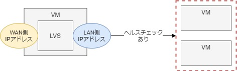
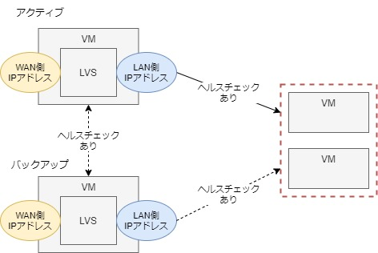

# 3. 負荷分散（マルチホスト間（LVS+Keepalived））

- [3-1. LVS非冗長](#a1)
- [3-2. LVS冗長](#a2)
- [3-3. 参考](#a3)

Keepalivedを使ってLVS配下のサーバーの死活監視を行う。  
これにより、ダウンしているサーバーにはアクセスを振り分けないといった制御が可能になる。  

<span id="a1">

## 3-1. LVS非冗長



### A. 設定
LVSサーバー
```sh
# インストール
$ sudo yum install keepalived ipvsadm tcpdump

# クリア
$ sudo ipvsadm -C

# バックアップ
$ sudo cp -p /etc/keepalived/keepalived.conf /etc/keepalived/keepalived.conf.bk

# 設定ファイル
$ sudo vi /etc/keepalived/keepalived.conf
! Configuration File for keepalived

virtual_server 192.168.0.100 80 {
    delay_loop 6
    lb_algo rr
    lb_kind NAT
    protocol TCP

    real_server 192.168.33.11 80 {
        weight 1
        inhibit_on_failure
        HTTP_GET {
            url {
              path /
              status_code 200
            }
            connect_timeout 3
            nb_get_retry 3
            delay_before_retry 3
        }
    }
    real_server 192.168.33.12 80 {
        weight 1
        inhibit_on_failure
        HTTP_GET {
            url {
              path /
              status_code 200
            }
            connect_timeout 3
            nb_get_retry 3
            delay_before_retry 3
        }
    }
}

# サービススタート
$ sudo systemctl start keepalived

# 設定確認
$ sudo ipvsadm -ln
IP Virtual Server version 1.2.1 (size=4096)
Prot LocalAddress:Port Scheduler Flags
  -> RemoteAddress:Port           Forward Weight ActiveConn InActConn
TCP  192.168.0.100:80 rr
  -> 192.168.33.11:80             Masq    1      0          0
  -> 192.168.33.12:80             Masq    1      0          0
```
- NIC（ip a）には変化なし

LVS配下サーバー
- [2-2. 配下サーバーの設定](LB02.md#a2)の設定と同じ（追加設定などなし）

<span id="a2">

### B. 確認
WSL
```sh
$ curl 192.168.0.100
<html><h1>Hello Docker2</h1></html>

$ curl 192.168.0.100
<html><h1>Hello Docker1</h1></html>
```
- curlではおおよそラウンドロビンでアクセス先が切り替わるが、ブラウザでは切り替わらなかった。原因は謎。

LVS配下サーバー
```sh
# 2台のうち1台のhttpdを止める
$ sudo systemctl stop httpd
```
WSL
```sh
# 生きているサーバーにのみアクセスが行っている
$ curl 192.168.0.100
<html><h1>Hello Docker1</h1></html>
$ curl 192.168.0.100
<html><h1>Hello Docker1</h1></html>
$ curl 192.168.0.100
<html><h1>Hello Docker1</h1></html>
```
LVSサーバー
```sh
# httpdを落としたサーバーのコネクションは増えない
$ sudo ipvsadm -ln
IP Virtual Server version 1.2.1 (size=4096)
Prot LocalAddress:Port Scheduler Flags
  -> RemoteAddress:Port           Forward Weight ActiveConn InActConn
TCP  192.168.0.100:80 rr
  -> 192.168.33.11:80             Masq    1      0          19
  -> 192.168.33.12:80             Masq    0      0          4
```
## 3-2. LVS冗長

LVSサーバーをもう１台増やし冗長化する。
LVSサーバー自体の死活監視も行い、生きているLVSサーバーでアクセスを受け付けるようにする。



### A. 設定

２台ともに以下の同様の設定を行う。  
※ただし「state」の部分だけは`MASTER`と`BACKUP`で使い分けて設定する。

（3-1.と比べ、`virtual_server`の部分が追加されただけ）

LVSサーバー
```sh
# 設定ファイル
$ sudo vi /etc/keepalived/keepalived.conf
! Configuration File for keepalived

vrrp_instance VI_1 {
    state MASTER # BACKUP
    interface eth0
    virtual_router_id 51
    priority 100
    advert_int 3
    authentication {
        auth_type AH
        auth_pass sfjpvrrp
    }
    virtual_ipaddress {
        192.168.0.100 dev eth2
        192.168.33.10/24 dev eth1
    }
}

virtual_server 192.168.0.100 80 {
    delay_loop 6
    lb_algo rr
    lb_kind NAT
    protocol TCP

    real_server 192.168.33.11 80 {
        weight 1
        inhibit_on_failure
        HTTP_GET {
            url {
              path /
              status_code 200
            }
            connect_timeout 3
            nb_get_retry 3
            delay_before_retry 3
        }
    }
    real_server 192.168.33.12 80 {
        weight 1
        inhibit_on_failure
        HTTP_GET {
            url {
              path /
              status_code 200
            }
            connect_timeout 3
            nb_get_retry 3
            delay_before_retry 3
        }
    }
}

# サービスリスタート
$ sudo systemctl restart keepalived

# 設定確認
$ sudo ipvsadm -ln
IP Virtual Server version 1.2.1 (size=4096)
Prot LocalAddress:Port Scheduler Flags
  -> RemoteAddress:Port           Forward Weight ActiveConn InActConn
TCP  192.168.0.19:80 rr
  -> 192.168.33.11:80             Masq    1      0          0
  -> 192.168.33.12:80             Masq    0      0          0

# NIC確認
# 以下はスタンバイのLVSサーバーの設定
# アクティブのLVSサーバーの値が追加されている
$ ip a | egrep ': |inet '
1: lo: <LOOPBACK,UP,LOWER_UP> mtu 65536 qdisc noqueue state UNKNOWN group default qlen 1000
    inet 127.0.0.1/8 scope host lo
2: eth0: <BROADCAST,MULTICAST,UP,LOWER_UP> mtu 1500 qdisc pfifo_fast state UP group default qlen 1000
    inet 10.0.2.15/24 brd 10.0.2.255 scope global noprefixroute dynamic eth0
3: eth1: <BROADCAST,MULTICAST,UP,LOWER_UP> mtu 1500 qdisc pfifo_fast state UP group default qlen 1000
    inet 192.168.33.20/24 brd 192.168.33.255 scope global noprefixroute eth1
    inet 192.168.33.10/24 scope global secondary eth1 # ★
4: eth2: <BROADCAST,MULTICAST,UP,LOWER_UP> mtu 1500 qdisc pfifo_fast state UP group default qlen 1000
    inet 192.168.0.101/24 brd 192.168.0.255 scope global noprefixroute eth2
    inet 192.168.0.100/32 scope global eth2 # ★
```
### B. 確認

アクティブなLVSの方をシャットダウン
```sh
$ exit
$ vagrant halt
```

WSL
```sh
# バックアップLVSにより、アクセスが正常に振り分けられた
$ curl 192.168.0.100
<html><h1>Hello Docker1</h1></html>
$ curl 192.168.0.100
<html><h1>Hello Docker2</h1></html>
$ curl 192.168.0.100
<html><h1>Hello Docker1</h1></html>
```

<span id="a3">

## 3-3. 参考
全般：https://knowledge.sakura.ad.jp/274/4/