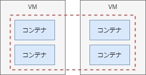

# 4. 負荷分散（マルチホスト間(オーバーレイネットワーク)）

- [4-1. 負荷分散の確認](#a1)
- [4-2. コンテナ間の疎通確認](#a2)
- [4-3. トラブルシューティング](#a3)
- [4-4. 参考](#a4)

Dockerの「オーバーレイネットワーク」という機能を使って、マルチホスト間での負荷分散を実現する。  

オーバーレイネットワークを簡単に利用するためのDocker Swarmという機能を利用する。  
（同様の機能を持ち大規模システムで利用ケースが増えているkubernetesについては触れない）  

また、コンテナ間における疎通状況も確認してみる。




<span id="a1">

## 4-1. 負荷分散の確認

Docker Swarmを使ってクラスタを構成するためには、以下の２種類のノードが必要。
- マネージャノード // クラスタを管理。以下では(M)と表記
- ワーカーノード // 管理される側。以下では(W)と表記

基本的に作業はマネージャノードで一括して行うことになる。

### A. クラスタの作成

マネージャノードで初期化作業をする。

VM1（M）
```sh
# 引数には自身のIPアドレスを指定
$ docker swarm init --advertise-addr=192.168.33.11
Swarm initialized: current node (lykelddnp3x7w5qn6w5u6r9rc) is now a manager.

To add a worker to this swarm, run the following command:

    docker swarm join --token SWMTKN-1-1smiz7q56llayjn2dkhy70vw3r0ghqgul84gfs8abf50pkmw7h-3ob0p02n4naub9pl61yqfqj2p 192.168.33.11:2377 # ★この行をコピー

To add a manager to this swarm, run 'docker swarm join-token manager' and follow the instructions.
```

ワーカーノードにて、上記でコピーした文言をペーストする。

VM2（W）
```sh
$ docker swarm join --token SWMTKN-1-1smiz7q56llayjn2dkhy70vw3r0ghqgul84gfs8abf50pkmw7h-3ob0p02n4naub9pl61yqfqj2p 192.168.33.11:2377
This node joined a swarm as a worker.
```

VM1（M）
```sh
# Swarmクラスタとして登録された
$ docker node ls
ID                            HOSTNAME            STATUS              AVAILABILITY        MANAGER STATUS      ENGINE VERSION
lykelddnp3x7w5qn6w5u6r9rc *   docker1             Ready               Active              Leader              19.03.8
x2wv3k4dsc1ptdu59gtpomnoo     docker2             Ready               Active                                  19.03.8
```

### B. ネットワークの作成
オーバーレイネットワークを作成する。  
デフォルトでingressというオーバーレイネットワークに追加されるが、名前解決できるようユーザー定義ネットワークを作成する。

VM1（M）
```sh
$ docker network create -d overlay --subnet 172.100.0.0/24 mynet01

$ docker network ls
c51576ad1bad        bridge              bridge              local
d804cc401e0c        docker_gwbridge     bridge              local
a7727a3774f9        host                host                local
sftqemmueg02        ingress             overlay             swarm # デフォルト
4d35aee38dab        lbnw-test           bridge              local
fzorqd75n3sl        mynet01             overlay             swarm # ★
```

### C. サービスの作成
ワーカノードでコンテナを作成する場合、`docker service`を使用する。

VM1（M）
```sh
# 4つのプロセスを立てる
$ docker service create --name test01 --network mynet01 -p 8080:80 --replicas=4 larsks/thttpd

# サービスの確認
$ docker service ls
ID                  NAME                MODE                REPLICAS            IMAGE                  PORTS
t29drvufq5xd        test01              replicated          4/4                 larsks/thttpd:latest   *:8080->80/tcp

# プロセスの確認
$ docker service ps test01
ID                  NAME                IMAGE                  NODE                DESIRED STATE       CURRENT STATE           ERROR               PORTS
62ko889ia7fq        test01.1            larsks/thttpd:latest   docker2             Running             Running 21 seconds ago
c7kxqzhdhl1z        test01.2            larsks/thttpd:latest   docker1             Running             Running 26 seconds ago
o8feda3ryffo        test01.3            larsks/thttpd:latest   docker2             Running             Running 21 seconds ago
vop6lbla2ght        test01.4            larsks/thttpd:latest   docker1             Running             Running 26 seconds ago
# -> NODE列を見ると、VM1台あたり2プロセス立ち上がっていることがわかる

$ docker ps
CONTAINER ID        IMAGE                  COMMAND                  CREATED             STATUS              PORTS               NAMES
5d795eb68f73        larsks/thttpd:latest   "/thttpd -D -l /dev/…"   44 seconds ago      Up 42 seconds                           test01.2.c7kxqzhdhl1zmo9r2khppv914
ed22d113ee86        larsks/thttpd:latest   "/thttpd -D -l /dev/…"   44 seconds ago      Up 42 seconds                           test01.4.vop6lbla2ght1ju9ahcm0jwjo
```
<details><summary>docker inspect test01の結果</summary>

よくわからんが念のため貼っておく。
```sh
$ docker inspect test01
[
    {
        "ID": "t29drvufq5xdwl56d73oxl37s",
        "Version": {
            "Index": 19
        },
        "CreatedAt": "2020-05-25T01:30:04.086208891Z",
        "UpdatedAt": "2020-05-25T01:30:04.087929337Z",
        "Spec": {
            "Name": "test01",
            "Labels": {},
            "TaskTemplate": {
                "ContainerSpec": {
                    "Image": "larsks/thttpd:latest@sha256:8178dd283823aa92e72be46b2fc26f73ceb5ba70a7073401ba193e222fe9c36c",
                    "Init": false,
                    "StopGracePeriod": 10000000000,
                    "DNSConfig": {},
                    "Isolation": "default"
                },
                "Resources": {
                    "Limits": {},
                    "Reservations": {}
                },
                "RestartPolicy": {
                    "Condition": "any",
                    "Delay": 5000000000,
                    "MaxAttempts": 0
                },
                "Placement": {
                    "Platforms": [
                        {
                            "Architecture": "amd64",
                            "OS": "linux"
                        }
                    ]
                },
                "Networks": [
                    {
                        "Target": "fzorqd75n3slcfq4ec4p82dhr"
                    }
                ],
                "ForceUpdate": 0,
                "Runtime": "container"
            },
            "Mode": {
                "Replicated": {
                    "Replicas": 4
                }
            },
            "UpdateConfig": {
                "Parallelism": 1,
                "FailureAction": "pause",
                "Monitor": 5000000000,
                "MaxFailureRatio": 0,
                "Order": "stop-first"
            },
            "RollbackConfig": {
                "Parallelism": 1,
                "FailureAction": "pause",
                "Monitor": 5000000000,
                "MaxFailureRatio": 0,
                "Order": "stop-first"
            },
            "EndpointSpec": {
                "Mode": "vip",
                "Ports": [
                    {
                        "Protocol": "tcp",
                        "TargetPort": 80,
                        "PublishedPort": 8080,
                        "PublishMode": "ingress"
                    }
                ]
            }
        },
        "Endpoint": {
            "Spec": {
                "Mode": "vip",
                "Ports": [
                    {
                        "Protocol": "tcp",
                        "TargetPort": 80,
                        "PublishedPort": 8080,
                        "PublishMode": "ingress"
                    }
                ]
            },
            "Ports": [
                {
                    "Protocol": "tcp",
                    "TargetPort": 80,
                    "PublishedPort": 8080,
                    "PublishMode": "ingress"
                }
            ],
            "VirtualIPs": [
                {
                    "NetworkID": "sftqemmueg02303v37p523n7x",
                    "Addr": "10.0.0.4/24"
                },
                {
                    "NetworkID": "fzorqd75n3slcfq4ec4p82dhr",
                    "Addr": "172.100.0.2/24"
                }
            ]
        }
    }
]


```

</details>
<details><summary>docker inspect mynet01の結果</summary>

VM1とVM2が`Peers`として登録されていればOK。ダメな時はなぜか一方が登録されなかった。
```sh
$ docker inspect mynet01
[
    {
        "Name": "mynet01",
        "Id": "fzorqd75n3slcfq4ec4p82dhr",
        "Created": "2020-05-25T10:30:04.256072572+09:00",
        "Scope": "swarm",
        "Driver": "overlay",
        "EnableIPv6": false,
        "IPAM": {
            "Driver": "default",
            "Options": null,
            "Config": [
                {
                    "Subnet": "172.100.0.0/24",
                    "Gateway": "172.100.0.1"
                }
            ]
        },
        "Internal": false,
        "Attachable": false,
        "Ingress": false,
        "ConfigFrom": {
            "Network": ""
        },
        "ConfigOnly": false,
        "Containers": {
            "5d795eb68f739ea107f5d3de90997a3396f73e0d3671e5b9ebddd33b17b1082a": {
                "Name": "test01.2.c7kxqzhdhl1zmo9r2khppv914",
                "EndpointID": "ce7b0cd9b89b596318f25da8919316c9725704a179e18548ea536bf10cf1246e",
                "MacAddress": "02:42:ac:64:00:03",
                "IPv4Address": "172.100.0.3/24",
                "IPv6Address": ""
            },
            "ed22d113ee865759a789572a41e52f143ef8458adb61fbf97e03cc5714746a8e": {
                "Name": "test01.4.vop6lbla2ght1ju9ahcm0jwjo",
                "EndpointID": "0d67cf19b6db8fc9947e66f09697aecae9a03b8239ef8fe68916d0f6a1634bfc",
                "MacAddress": "02:42:ac:64:00:05",
                "IPv4Address": "172.100.0.5/24",
                "IPv6Address": ""
            },
            "lb-mynet01": {
                "Name": "mynet01-endpoint",
                "EndpointID": "bba632f486dda993533371f732339787beafe227f2191cffa6cc5a003c35d80d",
                "MacAddress": "02:42:ac:64:00:07",
                "IPv4Address": "172.100.0.7/24",
                "IPv6Address": ""
            }
        },
        "Options": {
            "com.docker.network.driver.overlay.vxlanid_list": "4097"
        },
        "Labels": {},
        "Peers": [
            {
                "Name": "a59205bea732",
                "IP": "192.168.33.11" # ★
            },
            {
                "Name": "c38c6361a669",
                "IP": "192.168.33.12" # ★
            }
        ]
    }
]


```

</details>

### D. HTTPアクセス
VM1
```sh
# ログ確認のため以下を流しておく
$ docker service logs -f test01
```
WSL
```sh
# 以下8回実行
$ curl 192.168.33.11:8080
```
VM1
```sh
test01.3.3hf2fvj2vuta@docker2    | 10.0.0.2 - - [25/May/2020:00:38:12 +0000] "GET / HTTP/1.1" 200 1351 "" "curl/7.58.0"
test01.1.v34bls861kwf@docker2    | 10.0.0.2 - - [25/May/2020:00:38:15 +0000] "GET / HTTP/1.1" 200 1351 "" "curl/7.58.0"
test01.4.nwrb572m3d59@docker1    | 10.0.0.2 - - [25/May/2020:00:38:16 +0000] "GET / HTTP/1.1" 200 1351 "" "curl/7.58.0"
test01.2.uy3vn5qqmzpe@docker1    | 10.0.0.2 - - [25/May/2020:00:38:17 +0000] "GET / HTTP/1.1" 200 1351 "" "curl/7.58.0"
test01.3.3hf2fvj2vuta@docker2    | 10.0.0.2 - - [25/May/2020:00:38:28 +0000] "GET / HTTP/1.1" 200 1351 "" "curl/7.58.0"
test01.1.v34bls861kwf@docker2    | 10.0.0.2 - - [25/May/2020:00:38:29 +0000] "GET / HTTP/1.1" 200 1351 "" "curl/7.58.0"
test01.4.nwrb572m3d59@docker1    | 10.0.0.2 - - [25/May/2020:00:38:29 +0000] "GET / HTTP/1.1" 200 1351 "" "curl/7.58.0"
test01.2.uy3vn5qqmzpe@docker1    | 10.0.0.2 - - [25/May/2020:00:38:30 +0000] "GET / HTTP/1.1" 200 1351 "" "curl/7.58.0"
```
- ホストに関係なくクラスタ単位でラウンドロビンされている。

### E. サービス停止
```sh
$ docker service rm test01
```

<span id="a2">

## 4-2. コンテナ間の疎通確認
オーバーレイネットワーク内のコンテナ間の疎通確認を行う。
- コンテナA ->  コンテナB // 同一ホスト内のコンテナ間通信
- コンテナA ->  コンテナD // マルチホスト間のコンテナ通信

### A. サービスの作成

VM1
```sh
# 今度はCentOSのコンテナを4つ立てる
# 何もしないとコンテナが落ちてしまうためtail -fする
$ docker service create --name test01 --network mynet01 --replicas=4 centos:centos7 tail -f

# サービスの確認
$ docker service ls
ID                  NAME                MODE                REPLICAS            IMAGE               PORTS
ic0vdq1044vl        test01              replicated          4/4                 centos:centos7

# プロセスの確認
$ docker service ps test01
ID                  NAME                IMAGE               NODE                DESIRED STATE       CURRENT STATE            ERROR               PORTS
dxqfyfo1g198        test01.1            centos:centos7      docker1             Running             Running 26 seconds ago
cewnw11fe55t        test01.2            centos:centos7      docker2             Running             Running 26 seconds ago
rb5wx8td4go9        test01.3            centos:centos7      docker1             Running             Running 26 seconds ago
ruqg7kw04htl        test01.4            centos:centos7      docker2             Running             Running 26 seconds ago

$ docker ps
CONTAINER ID        IMAGE               COMMAND             CREATED              STATUS              PORTS               NAMES
d36fa0866f9c        centos:centos7      "tail -f"           46 seconds ago      Up 44 seconds                           test01.1.dxqfyfo1g198tqus7n0rha7o6
f4b999334e0f        centos:centos7      "tail -f"           47 seconds ago      Up 44 seconds                           test01.3.rb5wx8td4go9n59yq88ibkcya
```

### B. 疎通確認（同一ホスト内のコンテナ間通信）
VM1
```sh
# コンテナA
$ docker inspect d36 | grep IPAddress
            "SecondaryIPAddresses": null,
            "IPAddress": "",
                    "IPAddress": "172.100.0.28",

# コンテナB
$ docker inspect f4b | grep IPAddress
            "SecondaryIPAddresses": null,
            "IPAddress": "",
                    "IPAddress": "172.100.0.30",

# コンテナA -> コンテナB
$ docker exec -it d36 bash

# IPアドレスでアクセス [OK]
[root@d36fa0866f9c /]# ping 172.100.0.30
PING 172.100.0.30 (172.100.0.30) 56(84) bytes of data.
64 bytes from 172.100.0.30: icmp_seq=1 ttl=64 time=0.066 ms
^C

# ホスト名でアクセス [OK]
[root@d36fa0866f9c /]# ping f4b999334e0f
PING f4b999334e0f (172.100.0.30) 56(84) bytes of data.
64 bytes from test01.3.rb5wx8td4go9n59yq88ibkcya.mynet01 (172.100.0.30): icmp_seq=1 ttl=64 time=0.029 ms
^C

# コンテナ名でアクセス [OK]
[root@d36fa0866f9c /]# ping test01.3.rb5wx8td4go9n59yq88ibkcya
PING test01.3.rb5wx8td4go9n59yq88ibkcya (172.100.0.30) 56(84) bytes of data.
64 bytes from test01.3.rb5wx8td4go9n59yq88ibkcya.mynet01 (172.100.0.30): icmp_seq=1 ttl=64 time=0.043 ms
^C
```

### C. 疎通確認（マルチホスト内のコンテナ通信）
VM2
```sh
$ docker ps
CONTAINER ID        IMAGE               COMMAND             CREATED             STATUS              PORTS               NAMES
d3fc869e513f        centos:centos7      "tail -f"           4 minutes ago       Up 4 minutes                            test01.4.ruqg7kw04htluuhvywwhnoaa9
ece1d6aa3f40        centos:centos7      "tail -f"           4 minutes ago       Up 4 minutes                            test01.2.cewnw11fe55t4dd8tonhdam0f

$ docker inspect d3f | grep IPAddress
            "SecondaryIPAddresses": null,
            "IPAddress": "",
                    "IPAddress": "172.100.0.31",
```

VM1
```sh
# コンテナA -> コンテナD
# IPアドレスでアクセス [OK]
[root@d36fa0866f9c /]# ping 172.100.0.31
PING 172.100.0.31 (172.100.0.31) 56(84) bytes of data.
64 bytes from 172.100.0.31: icmp_seq=1 ttl=64 time=0.503 ms
^C

# ホスト名でアクセス [OK]
[root@d36fa0866f9c /]# ping d3fc869e513f
PING d3fc869e513f (172.100.0.31) 56(84) bytes of data.
64 bytes from test01.4.ruqg7kw04htluuhvywwhnoaa9.mynet01 (172.100.0.31): icmp_seq=1 ttl=64 time=0.483 ms
^C

# コンテナ名でアクセス [OK]
[root@d36fa0866f9c /]# ping test01.4.ruqg7kw04htluuhvywwhnoaa9
PING test01.4.ruqg7kw04htluuhvywwhnoaa9 (172.100.0.31) 56(84) bytes of data.
64 bytes from test01.4.ruqg7kw04htluuhvywwhnoaa9.mynet01 (172.100.0.31): icmp_seq=1 ttl=64 time=0.431 ms
^C
```

### D. 停止
VM1
```
$ docker service rm test01
```

### E. クラスタから離脱
VM1
```sh
# マネージャノードの場合は-fが必要
$ docker swarm leave -f
```
VM2
```sh
$ docker swarm leave
```

<span id="a3">

## 4-3. トラブルシューティング
現象
- docker service createで正常終了してもコンテナのプロセスが上がらない

原因
- docker network createで作成したネットワークのサブネットが、既存のネットワークアドレスにかぶっているため。

対応
- ネットワークアドレスを別の値に変更する。

<span id="a4">

## 4-4. 参考

全般：
- https://tech.uzabase.com/entry/2017/08/23/175813
- https://www.itmedia.co.jp/enterprise/articles/1610/19/news009.html
- https://docs.docker.com/network/network-tutorial-overlay/
