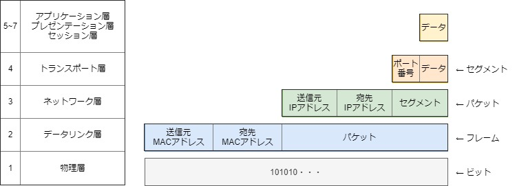

# LANを中心としたネットワークで勉強したこと

ネットワークには、大きく分けて以下の２つに分けられる。
- LAN  // 建物・フロア内の狭い範囲
- WAN  // LAN同士を接続する。インターネットも含む。

当ドキュメントではLANについて浅く広く簡潔に記載することを目指した。

## プロトコル
ネットワークを使って相互に通信するためにはプロトコル（規格）が必要。  
そのプロトコルをどのように構成していくのかを、標準化団体ISOが「OSI参照モデル」として提示した。  
一方で、現実に利用されているのは「TCP/IPプロトコル群」。  
https://www.sbbit.jp/article/cont1/12099?page=2

以下は全部覚える！

|レイヤ|OSI参照モデル|TCP/IPプロトコル群|実装プロトコルの例|
|--|--|--|--|
|7|アプリケーション層|アプリケーション層|HTTP,FTP,DHCP,TLS(※1)|
|6|プレゼンテーション層|〃|〃|
|5|セッション層|〃|〃|
|4|トランスポート層|トランスポート層|TCP,UDP|
|3|ネットワーク層|インターネット層|IP,ARP,ICMP|
|2|データリンク層|ネットワークインターフェース層|Ethernet|
|1|物理層|〃|〃|

## LANに必要な機器
- ホスト
- NIC（ネットワークインターフェースカード）
- ケーブル（ネットワーキングメディア）
    - 同軸ケーブル // 同軸ケーブル同士をつなげるにはトランシーバが必要
    - ツイストペア（UTP）
    - 光ファイバ
    
    |規格|ケーブル|トポロジー|伝送速度|利用頻度|
    |--|--|--|--|--|
    |10BASE5|同軸|バス|10Mbps|×|
    |10BASE2|同軸|スター|10Mbps|×|
    |10BASE-T|UTP|スター|10Mbps|×|
    |100BASE-TX|UTP|スター|100Mbps|〇|
    |1000BASE-T|UTP|スター|1Gbps|〇|
    |光ファイバは省略|||
    - Windowsならデバイスドライバで使用中の規格を確認できる。GBEなら1000BASE-T。
    https://support.eonet.jp/connect/net/1g/win10.html
- ネットワーキングデバイス
    |レイヤ|デバイス|ポート数|処理機構|利用頻度|コリジョンドメイン分割|ブロードキャストドメイン分割|備考|
    |--|--|--|--|--|--|--|--|
    |3|ルータ|N|ソフト|〇|〇|〇|WAN接続用|
    |〃|L3スイッチ|N|ハード|〇|〇|〇|LAN接続用|
    |2|L2スイッチ|N|ハード|〇|〇|×|〃|
    |〃|ブリッジ|1|ソフト|×|△|×|〃|
    |1|ハブ|N|ハード|×|×|×|〃|
    |〃|リピータ|1|ハード|×|×|×|〃|
    
    - ハブには内部にトランシーバが内臓されている。なので同軸ケーブル＋トランシーバの組み合わせは不要になりUTPのみ複線化できる。（バス -> スター型のトポロジ）

### 図解　コリジョンドメインとブロードキャストドメイン


https://www.atmarkit.co.jp/ait/articles/1503/12/news011.html

https://www.cisco.com/c/m/ja_jp/meraki/documentation/ms/layer-3-switching/layer-3-versus-layer-2-switch-for-vlans.html
https://japan.zdnet.com/article/35137199/

## カプセル化
データを送信する際は、上から下のレイヤに向かって各レイヤで順にデータをカプセル化する。受信する際は逆の処理順になる。


- レイヤ4
   - 上位層から送られたデータにポート番号などを付与し「セグメント」を作成。
- レイヤ3
   - レイヤ4から送られてきたセグメントに、送信元・宛先IPアドレスを付与し「パケット」を作成。
      - 送信元IPアドレスの決定
         - 動的：サーバー起動時にdhclientコマンドでDHCPから自動取得（後述）
         - 静的：手動設定
      - 宛先IPアドレスの決定
         - アプリケーションがIPアドレスを指定している場合、そのIPを使用。
         - アプリケーションがドメイン名を指定している場合、DNSサーバーに名前解決（後述）
   してもらう。
- レイヤ2
   - レイヤ3から送られてきたフレームに、送信元・宛先MACアドレスを付与して「フレーム」を作成
      - 送信元MACアドレスの決定
         - NICに初期登録されているものを使用
      - 宛先MACアドレスの決定
         - ARPテーブルから取得する。該当データが登録されていなければARP要求をする。（後述）

**4つのアドレスは重要なので覚えておく**
   - 送信元IPアドレス（L3）
   - 宛先IPアドレス（L3）
   - 送信元MACアドレス（L2）
   - 宛先MACアドレス（L2）

### DHCP
   - DHCPはレイヤ7。※上記カプセル化の1~7の処理全てを使用して処理される。
   - クライアントは、DHCPのメッセージをブロードキャスト(送信先)してDHCPサーバーを見つける。
   - 見つかったDHCPサーバーとやり取りしてIPアドレスを決定する。
   - 一連のやり取りに使うメッセージタイプは以下の4つ。
      - DHCPDISCOVER
      - DHCPOFFER
      - DHCPREQUEST
      - DHCPNAK

### DNS
- DNSはレイヤ7。※上記カプセル化の1~7の処理全てを使用して処理される。
- クライアントのスタブリゾルバは、/etc/resolve.confのnameserverに指定してあるフルサービスリゾルバに送信先ドメイン名のIPアドレスを問い合わせる（再帰的問い合わせ）。
   - フルサービスリゾルバにキャッシュが残っていればそれを返して終了。
- フルサービスリゾルバは、コンテンツサーバー群から該当のドメイン名を反復的に問い合わせてIPアドレスを取得する。（反復的問い合わせ）  

   https://www.atmarkit.co.jp/ait/articles/0112/18/news001.html
   https://www.atmarkit.co.jp/fnetwork/dnstips/010.html|
### ARP
- 自身のARPテーブルを参照する。（コマンド「ip neigh」で確認できる）
- なければARP要求をブロードキャスト。
- ARPはレイヤ2。フレームのパケットにはARPパケット(宛先IPアドレスはこの中に入っている)というものが入る。
- ブロードキャストを受信した各ホストは宛先IPアドレスに合致した場合にMACアドレスを返す。
- ARP送信側は、そのMACアドレスをARPテーブルに登録する。

## データ送信時
### [レイヤ3] ルーティング
- 次の送信先を決定するためにノード自身のルーティングテーブルを参照する。
   ```sh
   $ ip route
   default via 10.0.2.2 dev eth0 proto dhcp metric 100
   10.0.2.0/24 dev eth0 proto kernel scope link src 10.0.2.15 metric 100
   192.168.33.0/24 dev eth1 proto kernel scope link src 192.168.33.12 metric 101
   ```
- ルーティングテーブルには、ネットワークアドレス（サブネットマスク付）と転送先のIPアドレスが登録されている。
   - 同一ネットワークかの判定方法  
      以下の値が等しければ同一ネットワーク。
      - 送信元IPアドレスと送信元のサブネットマスクの論理和
      - 宛先IPアドレスと**送信元**のサブネットマスクの論理和

## 例


#### A) ホストAがホストBにPingを送る。

|#|概要|プロトコル|レイヤ|説明|
|--|--|--|--|--|
|⓪|ICMP送信用フレームを準備|ICMP|3|4つのアドレスを求めるため以下①~④の処理を行い、⑤で送信する|
|①|送信元IPアドレスの取得|DHCP|7~1|<ul><li>ホストAから、L2スイッチ配下の全てのホストにブロードキャストして取得。（ポート67）</li></ul>|
|②|宛先IPアドレスの取得|DNS|7~1|<ul><li>ホストAから、フルサービスリゾルバであるDNSサーバーにホストBのIPアドレスを要求。</li><ul>|
|③|送信元MACドレスの取得|-|-|（NICに初期登録されているものを使用するので処理なし）|
|④|宛先MACアドレスの取得|ARP|2~1|<ul><li>ホストAとBは同一ネットワークなので、ホストAからL2スイッチ配下にARP要求をブロードキャストしてホストBのMACアドレスを取得。</li><li>MACアドレスをARPテーブルに登録。</li></ul>|
|⑤|送信|-|1|<ul><li>ビット化したフレームを送信（ホストA->L2スイッチ->ホストB）</li></ul>|

#### B) ホストAがホストZにHTTPアクセスする。

|#|概要|プロトコル|レイヤ|説明|
|--|--|--|--|--|
|⓪|HTTP送信用フレームを準備|HTTP|7|4つのアドレスを求めるため以下①~④の処理を行い、⑤で送信する|
|①|送信元IPアドレスの取得|DHCP|7~1|<ul><li>ホストAから、L2スイッチ配下の全てのホストにブロードキャストして取得。（ポート67）</li></ul>|
|②|宛先IPアドレスの取得|DNS|7~1|<ul><li>ホストAから、フルサービスリゾルバであるDNS1にホストZのIPアドレスを要求。</li><li>DNS1にホストZのドメインが登録されていないので、DNS1はDNS2に問い合わせる。</li></ul>|
|③|送信元MACドレスの取得|-|-|（NICに初期登録されているものを使用するので処理なし）|
|④|宛先MACアドレスの取得|ARP|3~1|<ul><li>ホストAとホストBは異なるネットワークなので、ホストAからARP要求をブロードキャストしてデフォルトゲートウェイであるL3スイッチのMACアドレスを取得。</li><li>L3スイッチのMACアドレスをARPテーブルに登録</li></ul>|
|⑤|送信|-|1|<ul><li>①~④で求めたアドレスをもとにホストA->L3スイッチに送信</li></ul>|
|⑥|宛先MACアドレスの取得|ARP|3~1|<ul><li>L3スイッチは、受け取ったフレーム内の宛先IPアドレスとホストZが異なるネットワークであることを確認する。<li>ルータ1からルータ2に繋がるルータxのIPアドレスを求めARP要求をブロードキャストしMACアドレスを取得。</li><li>ルータ2に繋がるルータxのMACアドレスをARPテーブルに登録</li></ul>|
|⑦|送信|-|1|⑥で求めたアドレスをもとにL3スイッチ-> ルータxにデータを送信|
|⑧|-|-|-|ホストZに到達するまで⑥⑦を繰り返し実行|

### その他
DHCPリレーエージェント
- https://ascii.jp/elem/000/000/449/449327/6/
- https://www.infraexpert.com/study/tcpip14.html


★
https://xtech.nikkei.com/it/article/COLUMN/20070926/282842/