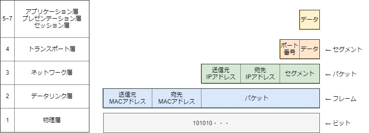
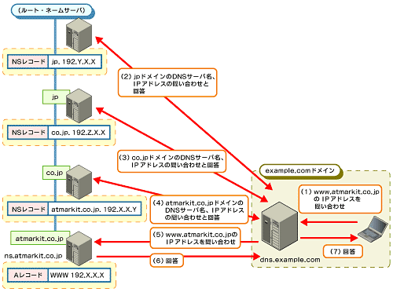
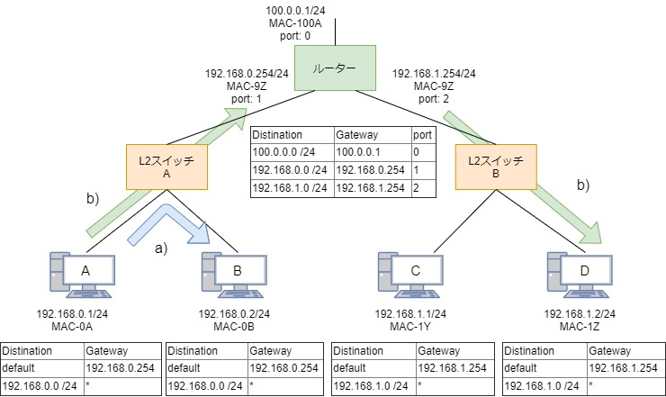
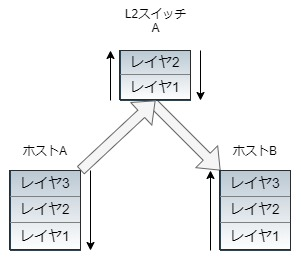
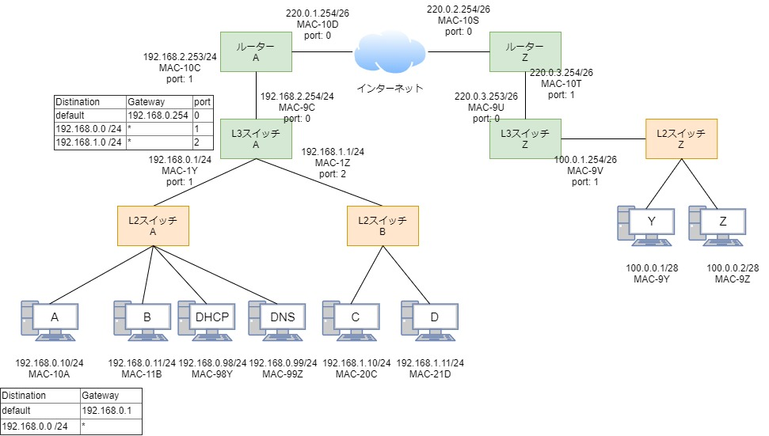

# 1. ネットワークの勉強（LAN中心）

- [1.1 OSI参照モデル](#a1)
- [1.2 物理側から見たネットワーク](#a2)
- [1.3 論理側から見たネットワーク](#a3)
- [1.4 ルーティング](#a4)
- [1.5 おさらい](#a5)
- [1.6 参考](#a6)

ネットワークには、大きく分けて以下の２つに分けられる。
- LAN  // 建物・フロア内の狭い範囲
- WAN  // LAN同士を接続する。インターネットも含む。

当ドキュメントではLANについて浅く広く簡潔に記載する。

## 1.1 OSI参照モデル
異なるベンダ間で相互通信するための規格に「OSI参照モデル」がある。  
OSI参照モデルは7階層に分かれており、ネットワークを理解するためには必須な概念。  
ただしこれはあくまでモデルであり、現実に利用されているプロトコルは必ずしもそのモデルにきれいにあてはまるわけではない（特にレイヤ5~7）。

|レイヤ|OSI参照モデル|実装プロトコルの例|
|--|--|--|
|7|アプリケーション層|HTTP,FTP,DHCP,TLS(※1)|
|6|プレゼンテーション層|〃|
|5|セッション層|〃|
|4|トランスポート層|TCP,UDP|
|3|ネットワーク層|IP,ARP,ICMP|
|2|データリンク層|Ethernet|
|1|物理層|〃|

## 1.2 物理側から見たネットワーク
#### A. LANに必要な機器
- ホスト
- NIC（ネットワークインターフェースカード）
- ケーブル（ネットワーキングメディア）
   - 種類
      - 同軸ケーブル // 同軸ケーブル同士をつなげるにはトランシーバという機器が必要
      - ツイストペア（UTP）
      - 光ファイバ
   - 規格
      |規格|ケーブル|トポロジー|伝送速度|利用頻度|
      |--|--|--|--|--|
      |10BASE5|同軸|バス|10Mbps|×|
      |10BASE2|同軸|スター|10Mbps|×|
      |10BASE-T|UTP|スター|10Mbps|×|
      |100BASE-TX|UTP|スター|100Mbps|〇|
      |1000BASE-T|UTP|スター|1Gbps|〇|
      - UTPは非シールドツイストペアケーブルのこと。
      - 現在使われているのは100BASE-TXと1000BASE-T。
         - 使われていないものも把握しておきたい。過去の歴史的経緯などの理解に役立つ。
      - 光ファイバについては省略
    - PCの使用中の規格を確認するには、Windowsの場合デバイスドライバを見る。  
      名称に「GBE」があれば1000BASE-T。
    https://support.eonet.jp/connect/net/1g/win10.html
- ネットワーキングデバイス
    |レイヤ|デバイス|ポート数|保有アドレス|処理主体|利用頻度|コリジョン ドメイン分割|ブロードキャスト ドメイン分割|備考|
    |--|--|--|--|--|--|--|--|--|
    |3|ルータ|N|IPアドレス|ソフト|〇|〇|〇|WAN接続用(NAT,NAPT対応)|
    |〃|L3スイッチ|N|〃|ハード|〇|〇|〇|LAN接続用|
    |2|L2スイッチ|N|MACアドレス|ハード|〇|〇|×|〃|
    |〃|ブリッジ|1|〃|ソフト|×|△|×|〃|
    |1|ハブ|N|-|ハード|×|×|×|〃|
    |〃|リピータ|1|-|ハード|×|×|×|〃|
    
   - ポートとは、デバイスとケーブルをつなぐ接続口。
   - 保有アドレスは、各ポートに設定されるアドレスのことを表す。
   - 処理主体について、「ハード」の方が「ソフト」よりも処理速度が速い。
   - ハブには内部に「トランシーバ」が内臓されている。なので扱いにくい同軸ケーブル＋トランシーバの組み合わせは不要になり、ハブにUTPを接続するだけでよくなった。（バス -> スター型のトポロジ）
   - コリジョンドメイン（信号の衝突する範囲）とブロードキャストドメイン（全送信の範囲）については1.3を参照。
   - ブリッジのコリジョンドメイン分割が△なのは、ポート単位では分割するがポートの先の各ホストには全て送信してしまうため。

#### B. コリジョンドメインとブロードキャストドメイン
図にしてみた。

参考：https://www.atmarkit.co.jp/ait/articles/1503/12/news011.html

## 1.3 論理面からみたネットワーク
#### A. カプセル化
各ノード（ホストやネットワーキングデバイス）がデータを送信する際は、上から下の順に各レイヤでデータをカプセル化する。  
データを受信する際は逆の順番で処理する。

- レイヤ5~7
   - アプリケーションプログラムがデータを作成。
- レイヤ4
   - 上位層から送られたデータにポート番号などを付与し「セグメント」を作成。
- レイヤ3
   - レイヤ4から送られてきたセグメントに、送信元・宛先IPアドレスを付与し「パケット」を作成。
      - 送信元IPアドレスの決定
         - 動的：サーバー起動時にdhclientコマンドでDHCPサーバーから自動取得（後述）// 主流
         - 静的：手動設定
      - 宛先IPアドレスの決定
         - アプリケーションがIPアドレスを指定している場合、そのIPを使用。
         - アプリケーションがドメイン名を指定している場合、DNSサーバーに名前解決（後述）
   してもらう。
- レイヤ2
   - レイヤ3から送られてきたフレームに、送信元・宛先MACアドレスを付与して「フレーム」を作成
      - 送信元MACアドレスの決定
         - NICに初期登録されているものを使用
      - 宛先MACアドレスの決定
         - 自身のARPテーブルから取得する。該当データが登録されていなければARP要求をブロードキャストして結果をARPテーブルに登録する。（後述）

**データの送信には以下4つのアドレスが必要なので覚えておく。**
   - 送信元IPアドレス（L3）
   - 宛先IPアドレス（L3）
   - 送信元MACアドレス（L2）
   - 宛先MACアドレス（L2）

#### B. DHCP
   - ホストの設定情報（IPアドレスなど）を取得する際に使用するプロトコル。レイヤ7。
   - クライアントは、DHCPのメッセージをブロードキャスト(送信先)してDHCPサーバーを見つける。
   - 見つかったDHCPサーバーとやり取りしてIPアドレスを決定する。
   - 一連のやり取りに使うメッセージタイプは以下の4つ。
      - DHCPDISCOVER
      - DHCPOFFER
      - DHCPREQUEST
      - DHCPNAK

   - DHCP(DNS)リレーエージェントというものを利用すると、クライアントとDHCP(DNS)サーバーを異なるネットワークに配置できる。  
   参考：
      - https://ascii.jp/elem/000/000/449/449327/6/
      - https://www.infraexpert.com/study/tcpip14.html

#### C. DNS

- ドメイン名に対応するIPアドレスを取得する際に使用するプロトコル。レイヤ7。
- クライアントのスタブリゾルバは、/etc/resolve.confのnameserverに指定してあるフルサービスリゾルバに送信先ドメイン名のIPアドレスを問い合わせる（再帰的問い合わせ）。
   - スタブリゾルバはプロセスではなくOSで提供される関数orライブラリ。
      Windowsではキャッシュ機能をもつ（Linuxではキャッシュ機能なし）
- フルサービスリゾルバは、コンテンツサーバー群から該当のドメイン名を反復的に問い合わせてIPアドレスを取得する。（反復的問い合わせ） 
   - フルサービスリゾルバにキャッシュが残っていればそれを返して終了。
   - IPアドレスのドメイン階層ごとに存在するコンテンツサーバー群をルートから遡って問い合わせる。
     
   https://image.itmedia.co.jp/ait/articles/0112/18/r3zu04.gif
- 一連の処理はdigコマンドで確認できる。

参考：
   - DNSの全体像：
      - https://www.atmarkit.co.jp/ait/articles/0112/18/news001.html
      - https://www.atmarkit.co.jp/ait/articles/1706/23/news042.html
   - リゾルバとは： https://www.atmarkit.co.jp/fnetwork/dnstips/010.html
   - スタブリゾルバ：https://www.atmarkit.co.jp/fnetwork/dnstips/010.html
   - LinuxのDNSキャッシュはない：https://www.na3.jp/entry/20081013/p2
   - 再帰問い合わせ：https://jprs.jp/glossary/index.php?ID=0173
   - ドメイン設定 win linux：
https://www.atmarkit.co.jp/ait/articles/0203/21/news002.html
   - > Dnsmasqとは、小規模ネットワーク向けのDNS/DHCP/TFTPサーバーです。Dnsmasqは自身の/etc/hostsファイルを参照してDNSクエリに応答してくれるため、/etc/hostsにレコードを追加するだけで、お手軽に家庭内DNSコンテンツサーバー兼キャッシュサーバーとして利用することができます  
   https://www.infiniteloop.co.jp/blog/2015/04/how_to_use_dnsmasq/

#### D. ARP

- IPアドレスに対応するMACアドレスを取得する際に使用するプロトロコル。レイヤ3。
- 宛先IPアドレスを持つホストのMACアドレスを、自身のARPテーブルから取得する。（コマンド「ip neigh」で確認できる）
   - なければARP要求をブロードキャスト。
   - フレームのパケットにはARPパケット(宛先IPアドレスはこの中に入っている)というものが入る。
   - ブロードキャストを受信した各ホストは、宛先IPアドレスに合致した場合にMACアドレスを返す。
   - ARP要求送信側は、そのMACアドレスをARPテーブルに登録する。

      |IPアドレス|MACアドレス|タイプ|
      |--|--|--|
      |192.168.0.1|MAC-0A|dynamic|
      |192.168.0.2|MAC-0B|static|

## 1.4 ルーティング

#### a) ホストAからホストBにパケットを送る場合
- ホストA

   |レイヤ|処理|重要項目|送信元|宛先|
   |--|--|--|--|--|
   |3|パケットを作成|IPアドレス|192.168.0.1|192.168.0.2 (※1)|
   |2|フレームを作成|MACアドレス|MAC-0A|MAC-0B (※2)|
   |1|ビット化して送信|-|-|-|

   - (※1)
      - 自身のIPと宛先IPが同一ネットワークであることを確認。
         - 自身： 自身のIP × 自身のサブネットマスク = 192.168.0.1 × 255.255.255.0 = 192.168.0.0
         - 宛先： 宛先のIP × **自身の**サブネットマスク = 192.168.0.2 × 255.255.255.0 = 192.168.0.0
   - (※2) ARPテーブルを見て、宛先IPに対応するMACアドレスを設定。

- L2スイッチA

   |レイヤ|処理|重要項目|送信元|宛先|
   |--|--|--|--|--|
   |1|ビットを受信|-|-|-|
   |2|フレームに変換 (※1)|MACアドレス|MAC-0A|MAC-0B|
   |1|ビット化して送信|-|-|-|

   - (※1) L2スイッチはフレームの内容を変更しない。宛先MACアドレスに対応する自身のポートに回路をスイッチするだけ。

- ホストB

   |レイヤ|処理|重要項目|送信元|宛先|
   |--|--|--|--|--|
   |1|ビットを受信|-|-|-|
   |2|フレームに変換|MACアドレス|MAC-0A|MAC-0B|
   |3|パケットを取得|IPアドレス|192.168.0.1|192.168.0.2|

- イメージ  

   

   参考： https://japan.zdnet.com/article/35137199/
   
#### b) ホストAからホストDにパケットを送る場合

- ホストA

   |レイヤ|処理|重要項目|送信元|宛先|
   |--|--|--|--|--|
   |3|パケットを作成|IPアドレス|192.168.0.1|192.168.1.2 (※1)|
   |2|フレームを作成|MACアドレス|MAC-0A|**MAC-9Z** (※2)|
   |1|ビット化して送信|-|-|-|

   - (※1)
      - 自身のIPと宛先IPが異なるネットワークであることを確認。
         - 自身： 自身のIP × 自身のサブネットマスク = 192.168.0.1 × 255.255.255.0 = 192.168.0.0
         - 宛先： 宛先のIP × **自身の**サブネットマスク = 192.168.1.2 × 255.255.255.0 = 192.168.1.0
      - ルーティングテーブルのデフォルトルートに設定されているルーターのIPアドレス(192.168.0.254)を取得。
   - (※2) ARPテーブルを見て、デフォルトルートに対応するMACアドレスを設定。

- ルーター

   |レイヤ|処理|重要項目|送信元|宛先|
   |--|--|--|--|--|
   |1|ビットを受信|-|-|-|
   |2|フレームに変換|-|-|-|
   |3|パケットの確認|IPアドレス|192.168.0.1|192.168.1.2 (※1)|
   |2|フレームの編集|MACアドレス|**MAC-9Z** (※2)|**MAC-1Z** (※3)|
   |1|ビット化して送信|-|-|-|

   - (※1)
      - ルーティングテーブルを見て、宛先IPのネットワークのエントリを特定する。  
         ※ 宛先IPアドレスとルーティングテーブルのサブネットマスクの論理積から宛先のネットワークを求め、それがルーティングテーブルのDistinationと合致するか確認
         - 2行目 -> ×
            - 宛先のネットワーク = 192.168.1.2 × 255.255.255.0 = 192.168.1.0 
            - ルーティングテーブルのネットワーク = 192.168.0.0
         - 3行目 -> 〇
            - 宛先のネットワーク = 192.168.1.2 × 255.255.255.0 = 192.168.1.0
            - ルーティングテーブルのネットワーク = 192.168.1.0
      - 該当エントリの対応ポートから、宛先IP（192.168.1.254）に送信することがわかる。
   - (※2) ルーティングテーブルから取得したポート(2)のMACアドレス値に編集。
   - (※3) ARPテーブルを見て、ルーティングテーブルから取得した宛先IPのMACアドレスを設定。

   参考：
   - サブネットマスク： https://ascii.jp/elem/000/000/562/562310/2/
   - ルーティングテーブル
      - https://xtech.nikkei.com/it/article/COLUMN/20070926/282842/
      - https://ascii.jp/elem/000/000/592/592307/
      - https://milestone-of-se.nesuke.com/nw-basic/routing/routing-table/
   - ルーティングテーブルのアスタリスク(*)はホストに直接繋がっていることを示す。  
   https://qiita.com/m2mtu/items/790e9d9dfcd8d21f1d10

- ホストD

   |レイヤ|処理|重要項目|送信元|宛先|
   |--|--|--|--|--|
   |1|ビットを受信|-|-|-|
   |2|フレームに変換|MACアドレス|MAC-9Z|MAC-1Z|
   |3|パケットを取得|IPアドレス|192.168.0.1|192.168.1.2|

## 1.5 おさらい

ホストAがホストZのWebサイトを開いたときの内部挙動について。

#### A) ホストA

|レイヤ|処理|重要項目|送信元|宛先|
|--|--|--|--|--|
|5~7|データを作成|(リクエストデータ)|-|-|
|4|セグメントを作成|ポート|エフェメラルポート(1024~65535)|443|
|3|パケットを作成|IPアドレス|192.168.0.10 (※1)|100.0.0.2 (※2)|
|2|フレームを作成|MACアドレス|MAC-10A (※3)|MAC-1Y (※4)|
|1|ビット化して送信|-|-|-|

- (※1) ホストAとDHCPサーバーとでDHCPメッセージをやり取りし、送信元IPアドレスを決定。
   - DHCPメッセージのやりとり時も別途レイヤ7~1でカプセル化したデータを送受信している。
- (※2) ホストAとDNSサーバーとでDNSメッセージをやり取りし、ドメイン名から宛先IPアドレスを決定。
   - DNSメッセージのやりとり時も別途レイヤ7~1でカプセル化したデータを送受信している。
      - この場合、インターネット越しの宛先ドメインのDNSサーバーにアクセスしている。
   - 自身のIPと宛先IPが異なるネットワークであることを確認。
      - 自身： 自身のIP × 自身のサブネットマスク = 192.168.0.10 × 255.255.255.0 = 192.168.0.0
      - 宛先： 宛先のIP × 自身のサブネットマスク = 100.0.0.2 × 255.255.255.0 = 100.0.0.0
   - ルーティングテーブルのデフォルトルートに設定されているL3スイッチAのIPアドレス(192.168.0.1)を取得。
- (※3) NICに初期登録されているものを設定。
- (※4) ARPテーブルを見て、デフォルトルートに対応するMACアドレスを設定。

#### B) L2スイッチA

|レイヤ|処理|重要項目|送信元|宛先|
|--|--|--|--|--|
|1|ビットを受信|-|-|-|
|2|フレームに変換 (※1)|MACアドレス|MAC-10A|MAC-1Y|
|1|ビット化して送信|-|-|-|

- (※1) L2スイッチはフレームの内容を変更しない。宛先MACアドレスに対応する自身のポートに回路をスイッチするだけ。

#### C) L3スイッチA

|レイヤ|処理|重要項目|送信元|宛先|
|--|--|--|--|--|
|1|ビットを受信|-|-|-|
|2|フレームに変換|MACアドレス|MAC-10A|MAC-1Y|
|3|パケットの確認|IPアドレス|192.168.0.10|100.0.0.2 (※1)|
|2|フレームの編集|MACアドレス|**MAC-9C** (※2)|**MAC-10C** (※3)|
|1|ビット化して送信|-|-|-|

- (※1)
   - ルーティングテーブルを見て、宛先IPのネットワークのエントリを特定する。  
      ※ 宛先IPアドレスとルーティングテーブルのサブネットマスクの論理積から宛先のネットワークを求め、それがルーティングテーブルのDistinationと合致するか確認
      - 2行目 -> ×
         - 宛先のネットワーク = 10.0.0.2 × 255.255.255.0 = 192.168.1.0 
         - ルーティングテーブルのネットワーク = 192.168.0.0
      - 3行目 -> ×
         - 宛先のネットワーク = 10.0.0.2 × 255.255.255.0 = 192.168.1.0
         - ルーティングテーブルのネットワーク = 192.168.1.0
      - 1行目（デフォルトルート。他の行に合致しなかった場合このエントリを参照する） -> 〇
   - 該当エントリの対応ポート(0)から宛先IP（192.168.0.254）に送信することがわかる。
- (※2) ルーティングテーブルから取得したポートのMACアドレス値に編集。
- (※3) ARPテーブルを見て、ルーティングテーブルから取得した宛先IPのMACアドレスを設定。

#### D) ルーターA -> L2スイッチZ
（似たような処理なので記載省略）

#### E) ホストZ

|レイヤ|処理|重要項目|送信元|宛先|
|--|--|--|--|--|
|1|ビットを受信|-|-|-|
|2|フレームに変換|MACアドレス|MAC-9V|MAC-9Z|
|3|パケットを取得|IPアドレス|192.168.0.10|100.0.0.2|
|4|セグメントを取得|ポート|エフェメラルポート(1024~65535)|443|
|5~7|データを取得し宛先ポートの アプリケーションに渡す|(リクエストデータ)|-|-|
|5~7|Webサーバーの処理を受けとる|(レスポンスデータ）|-|-|
|4|セグメントを作成|-|-|-|
|3|パケットを作成|IPアドレス|**100.0.0.2** (※1)|**192.168.0.10** (※1)|
|2|フレームを作成|フレーム|**443** (※1)|**エフェメラルポート(1024~65535)** (※1)|
|1|ビット化し送信|-|-|

- (※1) 受信パケット、フレームの送信元・宛先を反対にしたものに編集

（以後、レスポンスがクライアントまで返るが記載は省略）

## 1.6 参考
- 全般： [3分間NetWorking](http://www5e.biglobe.ne.jp/aji/3min/index.html)
- 全般： Lepton先生のネットワーク技術勉強会
- 全般： Linuxで学びながら学ぶTCP/IPネットワーク入門