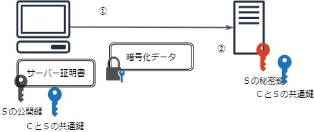

# 1. [基礎] SSLの仕組み

- [1-1. 概要](#a1)
- [1-2. 説明](#a2)
- [1-3. 図解](#a3)
- [1-4. 補足](#a4)
- [1-5. 参考](#a5)

## 1-1. 概要

なぜSSL証明書が必要なのか？SSLの仕組みを調べてみた。

## 1-2. 説明

例えばブラウザからあるWebサイトにアクセス(http)すると、以下の通信のリスクが存在する。
- 盗聴
- 改竄
- なりすまし
- 否認  

これらの脅威を防ぐために、以下のような機能をもつSSL通信(https)が必要になる。
- 暗号化通信 // 文字通り
- サイトの実在証明 // 接続先が信頼できるか

SSLは、
- SSLはOSI参照モデルのセッション層（第5層）に位置する**プロトコル**。  
-> トランスポート層（第4層,TCP/IPなど）以下は暗号化しない。
- SSL通信といっても、実際は**TLS**というSSLの後継プロトコルを使用している。  
（SSLという名前だけが残っている。TLSの最新verはTLS1.2 or 1.3）
- SSLはPKI（公開鍵暗号基盤）を実装したもので、PKIは公開鍵暗号という技術を利用した仕組み。  
https://www.atmarkit.co.jp/ait/articles/0012/19/news003.html

SSLを理解するにあたって大事なことは以下。
- 暗号化通信、接続先サイトの証明をするために必要な要素が、**公開鍵**と**秘密鍵**。
  - 電子データ ＋ 相手の**公開鍵** ＝ `暗号化`
  - 電子データ ＋ 自分の**秘密鍵** ＝ `署名`（＝電子署名、デジタル署名）
- 署名の安全性を高めるため`電子証明書`が必要。 https://dstmp.shachihata.co.jp/column/02191008/
  - 電子署名 : 電子証明書 ≒ 印鑑 : 印鑑証明書
- 電子証明書を発行してもらうために`証明局`が必要。
- 通常は、ルート証明局(ルートCA)の配下に中間証明局(中間CA)があり、電子証明書の承認構造を階層化している。
  - 階層化する理由は、ルートCAに問題があった場合にルート証明書を無効化した場合の影響を極小化するため。
  - 一般的なのは3階層と4階層。  
  (4階層は間にクロスルート用中間CA証明書を挟む。こうすることで、新旧どちらのルートCA証明書でもサーバー証明書を証明できる)。  
    
  
  https://www.cybertrust.ne.jp/sureserver/support/faq/tech_faq01.html
  - 例えば、Cybertrustは中間CA、セコムはルートCA。https://www.cybertrust.ne.jp/sureserver/support/download_ca.html
- ルートCA証明書はOSにデフォルトでインストールされている。
  - PCではルート証明書が自動更新されるが、自動更新されない携帯端末などをサポートするために、4階層のチェーンを選択可能なことも多い。  
  https://faq.valuessl.net/?cat=50  
  ※「1-4. 補足　C. 証明書管理方法」も参照
- 電子証明書を発行してもらうためには、CSRを添えて認証局に申請する必要がある。
  - CSRには、`公開鍵`とドメインや組織名などの申請者の情報が含まれる。
  - 電子証明書の種類
    - DV（Domain Validation）
    - OV（Organization Validation）
    - EV（Extended Validation ）// ブラウザのアドレスバーが緑色になる  
    https://knowledge.sakura.ad.jp/2988/
  - 電子証明書には期限がある。大体1年程度が多い。

上記内容を踏まえて、SSL証明書発行とSSL通信のおおよその流れを図解してみた。

## 1-3. 図解

以下のフェーズごとに記載する。
- A. 準備
- B. 初回アクセス
- C. 証明書チェーンのチェック
- D. データ転送
### A. 準備

|#|説明|備考|
|--|--|--|
|①|<ul><li>ルートCAは、自身の秘密鍵・公開鍵から作成したCSRを基に、自身でルート証明書を発行する。</li><ul><li>これは自己署名証明書（いわゆるオレオレ証明書）に当たり信頼性がない。</li><li>そのため、証明局にはサーバ証明書発行に関する基本要件やEVガイドラインの遵守が求められる。</li></ul></ul>|https://jp.globalsign.com/ssl-pki-info/pki/ca_trust.html|
|②|<ul><li>ブラウザには、①のルート証明書がデフォルトでインストールされている。</li></ul>|https://jp.globalsign.com/ssl-pki-info/pki/ca_trust.html|
|③|<ul><li>中間CAは、自身の秘密鍵・公開鍵から作成したCSRをルートCAに送る。</li></ul>|
|④|<ul><li>ルートCAは、CSRの内容を基に自身の秘密鍵で署名した中間CA証明書を発行する。</li></ul>
|⑤|<ul><li>サーバーは、自身の秘密鍵・公開鍵から作成したCSRを中間CAに送る。</li></ul>|
|⑥|<ul><li>中間CAは、CSRの内容を基に自身の秘密鍵で署名したサーバー証明書を発行する。</li></ul>|
|⑦|<ul><li>サーバー側のapacheなどのWebサーバーに、以下の3つを登録する。</li><ul><li>秘密鍵（サーバー自身の）</li><li>中間証明書（基本的にはブラウザ側で自動取得のはずだが、例外もあるため設定必要）</li><li>サーバー証明書</li></ul>|https://jp.globalsign.com/support/faq/58.html|

### B. 初回アクセス

|#|説明|備考|
|--|--|--|
|①|<ul><li>クライアントが、ブラウザでサーバーにhttpsアクセスする。</ul></li>||
|②|<ul><li>サーバーは、サーバー証明書と中間証明書を返す。</ul></li>|

### C. 証明書チェーンの確認

|#|説明|備考|
|--|--|--|
|①|<ul><li>クライアントは、サーバー証明書の正当性を検証する。</li><ul><li>中間CAの公開鍵を使って、サーバー証明書が中間CAの秘密鍵で署名されていることを確認。</li><li>ルートCAの公開鍵を使って、上記の中間CA証明書がルートCAの秘密鍵で署名されていることを確認。</li><li>上記のルート証明書がOSにインストールされていることを確認。</li></ul><li>問題なければ、アクセス先が正しく認証されたサーバーであることがわかる。</li></ul>|https://www.gleas.jp/news/column/certificate-chain|

### D. データ転送

|#|説明|備考|
|--|--|--|
|①|<ul><li>クライアントが、サーバーの公開鍵で共有した共通鍵を使って送信データを暗号化し、サーバーに送る。</li></ul>|詳細は「1-4. 補足B」参照|
|①|<ul><li>サーバーは、送信されたデータを共通鍵で復号化する。</li></ul>||

## 1-4. 補足
### A. 暗号化方式の種類
|種類|説明|鍵の管理・配布|速度|アルゴリズム|
|--|--|--|--|--|
|共通鍵暗号方式|暗号化・復号化とで使う鍵が同一|管理が煩雑（鍵が通信相手数分だけ必要）。配布も難しい|速い|AES|
|公開鍵暗号方式|暗号化・復号化とで使う鍵が異なる|管理・配布が容易|遅い|RSA|
|ハイブリッド暗号方式|共通鍵と公開鍵のハイブリッド|管理・配布が容易|速い|-|
※ SSLはハイブリッド暗号方式を採用

### B. D. データ転送について
SSL通信は複雑すぎるので、上記図解のイメージだけもっておけばok。（SSL証明書を更新するくらいであれば）

詳細（メモ書き）

※ データ転送の前にハンドシェイクフェーズがある。
|フェーズ|クライアント(C)|通信|サーバー(S)|備考|
|--|--|--|--|--|
|ハンドシェイク|ア + 乱1|=>||Cから送られたリストからアルゴリズムを決定 乱1も共有|
|||<=|サーバー証明書 + 乱2|サーバー側の証明書と生成した乱2を送信|
||Z + 公 = 暗|=>|暗 + 秘 + Z|CとSでZを共有|
||乱1 + 乱2 + Z + 関 = 共 + m|-|（左と同様）|CとSでそれぞれ共とMを算出 （入力が同じなので結果も同一値になる）|
||ア + Z + m + A = M|-|（左と同様）|〃（おそらくZの値の改ざんチェックが目的）|
||M + 共 = 暗|<=>|暗 + 共 = M|算出したMをそれぞれ比較して同一であることを確認|
|データ転送|デ + 共 = 暗, M|=>|暗 + 秘 = デ|Sでデを復号するとともに、Mとデを使って改ざんもチェック|

＜凡例＞
- ア ・・・ クライアントが対応しているアルゴリズムのリスト
- 乱 ・・・ 乱数
- Z ・・・ 共通鍵の元となる値
- 公 ・・・ サーバーの公開鍵
- 暗 ・・・ 暗号化データ
- 秘 ・・・ サーバーの秘密鍵
- 共 ・・・ 共通鍵
- m  ・・・ MAC鍵（MAC値を出すために必要）
- 関 ・・・ 鍵生成関数
- A  ・・・ MACアルゴリズム
- M  ・・・ MAC値（改ざん検知に使用する）

参考
- 食べる!SSL! - HTTPS環境構築から始めるSSL入門 第２版
もっと詳細は以下が参考になりそう（見てない）
- https://www.atmarkit.co.jp/ait/articles/0012/19/news003.html
- https://qiita.com/n-i-e/items/41673fd16d7bd1189a29

### C. 証明書管理方法
証明書はOSで管理されているが、ブラウザによってはそれが使われないケースがある。
  - Chrome、ie  
    -> OSで管理している証明書を利用
  - Firefox  
    -> ブラウザで独自管理している証明書を利用  
https://kekaku.addisteria.com/wp/20190327103825

### D. Cybertrustとさくらの関係
CybertrustとSakura internetはパートナー関係で、証明書の販売形態もうまく棲み分けしている模様。  
- DVはSakura、OVとEVはCybertrust
  - https://www.cybertrust.co.jp/blog/ssl/knowledge/certificates-types.html
  - https://ssl.sakura.ad.jp/jprs/?keyword=%E3%81%95%E3%81%8F%E3%82%89%20ssl&matchtype=e&adposition=&creative=383883217089&device=c&network=g&feeditemid=&targetid=aud-896783116206:kwd-97277912251&loc_physical_ms=1009252&gclid=EAIaIQobChMIhcDZ9pvp6AIVCraWCh3a-goNEAAYASAAEgIwFPD_BwE

# 1-5. 参考
- 全般： 食べる!SSL! - HTTPS環境構築から始めるSSL入門 第２版
- 全般： https://www.cybertrust.co.jp/blog/ssl/knowledge/
- CA： https://www.gleas.jp/news/column/certificate-chain
- 暗号： https://ssl.sakura.ad.jp/column/ssl/
- 暗号： https://dstmp.shachihata.co.jp/column/02191008/
- 時事： https://www.atmarkit.co.jp/ait/articles/2003/05/news010.html#cxrecs_s
- 時事： https://www.itmedia.co.jp/enterprise/articles/1510/30/news061.html
