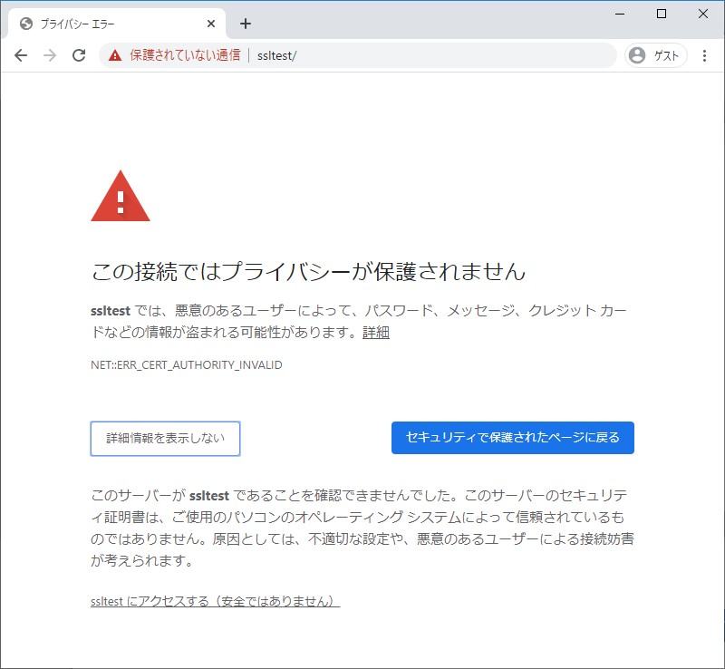
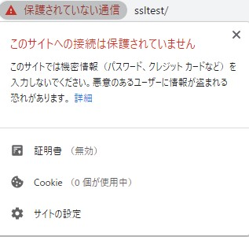
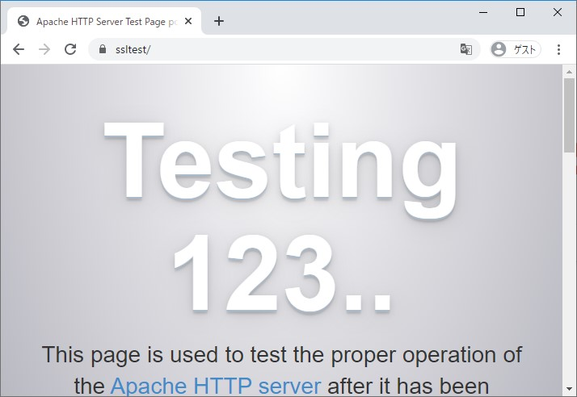
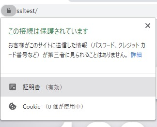
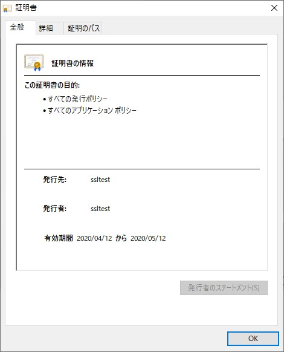
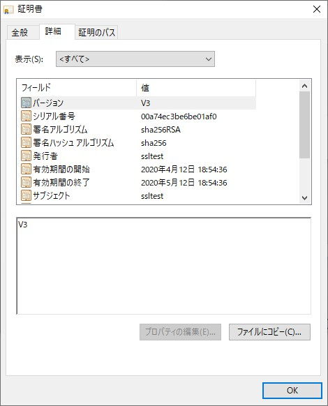
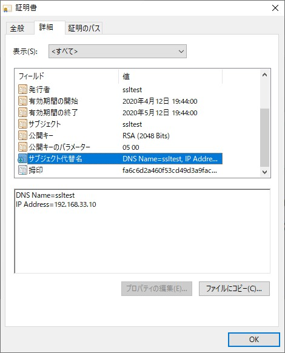
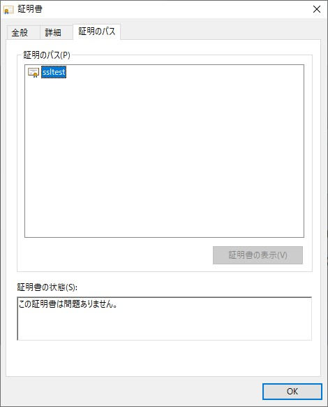

# 2. [実践] SSL接続するための設定

- [2-1. 概要](#a1)
- [2-2. 準備](#a2)
- [2-3. SSL証明書の作成](#a3)
- [2-4. OSに証明書を登録](#a4)
- [2-5. 補足](#a5)
- [2-6. 参考](#a6)

<span id="a1">

## 2-1. 概要

CentOSでApacheサーバーを立ててSSL接続する方法を記載する。  
※ お金と手間をかけずに実施するため、証明局に申請はせずに自己署名で確認してみた

<span id="a2">

## 2-2. 準備

### A. 環境
- Windows10 Home 1909
- Oracle VM VirtualBox 6.0.12
- Vagrant 2.2.5
- Google Chrome 81.0.4044.92（64 ビット）

### B. CentOSの準備
- VirtualBoxとVagrantでVMとしてCentOS7を立てる。
```sh
$ cd /c/vagrant/CentOS7_apache_SSL # 任意のディレクトリ

# 設定ファイル作成
$ vi Vagrantfile
# 以下記載
Vagrant.configure("2") do |config|
  config.vm.box = "centos/7"
  config.vm.hostname = "vagranthost"
  config.vm.network "forwarded_port", guest: 80, host: 8080
  config.vm.network "private_network", ip: "192.168.33.10" # VMのIP
  config.vm.network "public_network"
  config.vm.synced_folder ".", "/vagrant_data"
  # コンソールを表示
  config.vm.provider "virtualbox" do |vb|
    vb.gui = true
  end
  # タイムゾーンの変更
  config.vm.provision "shell", inline: <<-SHELL
    sudo ln -sf /usr/share/zoneinfo/Asia/Tokyo /etc/localtime
  SHELL
end

# VM作成
$ vagrant up

# ログイン
$ vagrant ssh

# バージョン確認
$ cat /etc/redhat-release
CentOS Linux release 7.7.1908 (Core)

# ログアウトする場合、VMからログアウトしてシャットダウンする
# $ exit
# $ vagrant halt
```

### C. インストール
```sh
# apacheとsslモジュールをインストール
# - apacheのパッケージ名はhttpd https://weblabo.oscasierra.net/apache-installing-apache24-yum-centos7-1/
$ sudo yum install httpd mod_ssl -y

# バージョン確認
$ httpd -version
Server version: Apache/2.4.6 (CentOS)
Server built:   Aug  8 2019 11:41:18

$ rpm -qa | grep mod_ssl
mod_ssl-2.4.6-90.el7.centos.x86_64

$ openssl version
OpenSSL 1.0.2k-fips  26 Jan 2017 # 1.1.xでないけどまあいいか

# 起動
$ sudo systemctl start httpd
$ sudo systemctl is-active httpd
active
```

### D. ブラウザから確認
- ipでアクセス
    - ブラウザで http://192.168.33.10/ にアクセスする。  
    -> Apacheのデフォルト画面が表示された。

- ドメイン名でアクセス 
    - hostsの変更
        - C:\Windows\System32\drivers\etc\hostsのバックアップを作成しておく
        - hostsに以下を追記。今回は「ssltest」というドメイン名でアクセスすることにした。
            ```
            192.168.33.10 ssltest
            ```
    - ブラウザで http://ssltest/ にアクセスする。  
        -> 初期設定では以下エラーになる。
        ```
        NET::ERR_CERT_AUTHORITY_INVALID

        このサーバーが ssltest であることを確認できませんでした。このサーバーのセキュリティ証明書は、ご使用のパソコンのオペレーティング システムによって信頼されているものではありません。原因としては、不適切な設定や、悪意のあるユーザーによる接続妨害が考えられます。
        ```

<span id="a3">

## 2-3. SSL証明書の作成

### A. 秘密鍵の作成
```sh
$ openssl genrsa > server.key

# 確認
# - 鍵長は2048bit以上が推奨されている
$ openssl rsa -text -noout -in server.key
Private-Key: (2048 bit)  # OK
modulus:
・・・
```
- opensslコマンド中の以下はどちらを使ってもok
    - 「>」= 「-out」
    - 「<」= 「-in」

### B. CSRの作成
```sh
# 最低限必要なCN(Common Name)のみ指定したいだけなので「-subj」で指定
# 「-subj」なしだと、国名・組織名・Emailアドレスなどを対話形式で聞かれる
$ openssl req -new -key server.key -subj "/CN=ssltest" > server.csr

# 確認
$ openssl req -text -noout -in server.csr
Certificate Request:
    Data:
        Version: 0 (0x0)
        Subject: CN=ssltest # OK
・・・
```
### C. サーバー証明書の作成
本来は証明局に証明書の発行依頼をするところだが、今回はローカルで自己署名する。
```sh
# ChromeではCNが無視されてSAN(subjectAltName)が使われるので、その設定ファイルを用意
# ブラウザからURLでアクセスする際、ドメイン名指定なら「DNS」、IP指定なら「IP」の指定が必要。今回は両方指定した。
$ vi v3_ext.txt
subjectAltName=DNS:ssltest,IP:192.168.33.10

# サーバー証明書の作成
$ openssl x509 -req -signkey server.key -extfile v3_ext.txt < server.csr > server.crt
Signature ok
subject=/CN=ssltest
Getting Private key

# 確認　※ここで表示された内容は、後述する2-3.にて画面から確認できる
$ openssl x509 -text -noout -in server.crt
・・・
    Signature Algorithm: sha256WithRSAEncryption # sha256が推奨なのでok
        Issuer: CN=ssltest # CN OK
        Validity # 期限は 2020/04/15 ~ 2020/05/15
            Not Before: Apr 15 02:21:59 2020 GMT
            Not After : May 15 02:21:59 2020 GMT
        Subject: CN=ssltest
        Subject Public Key Info:
            Public Key Algorithm: rsaEncryption 
                Public-Key: (2048 bit) # OK
                Modulus:
・・・
        X509v3 extensions:
            X509v3 Subject Alternative Name:
                DNS:ssltest, IP Address:192.168.33.10 # OK
    Signature Algorithm: sha256WithRSAEncryption # sha256が推奨なのでok
・・・

$ ls
server.crt  server.csr  server.key  v3_ext.txt
```

### D. apacheに証明書類を設定
```sh
# 証明書と秘密鍵を任意の場所にコピー
$ sudo cp -p server.{crt,key} /etc/httpd/conf/

# パスを指定
$ sudo vi /etc/httpd/conf.d/ssl.conf
#SSLCertificateFile /etc/pki/tls/certs/localhost.crt
SSLCertificateFile /etc/httpd/conf/server.crt

#SSLCertificateKeyFile /etc/pki/tls/private/localhost.key
SSLCertificateKeyFile /etc/httpd/conf/server.key

# 再起動
$ sudo systemctl restart httpd
```
- ブラウザで https://ssltest/ にアクセスするとまだ「ERR_CERT_AUTHORITY_INVALID」エラーのまま。
  <details>

  
  
  </details>

<span id="a4">

## 2-4. OSに証明書を登録
今回作成したのは自己署名の証明書なので、OSに手動で登録する必要がある。
### A. 証明書のエクスポート
以下の順にクリックしていく。
- Chromeのアドレスバーの鍵マーク
- 証明書
- 詳細
- ファイルにコピー
- 次へ
- DER Encoded binary X.509(.cer)
- （任意の名前で保存したうえで）次へ
- 完了

### B. 証明書のインポート
以下の順にクリックしていく。
- 設定
- プライバシーとセキュリティ > もっとみる > 証明書の管理
- 信頼されたルート証明機関
- インポート
- 次へ
- （先ほどエクスポートしたファイルを選択して）次へ
- （証明書を全て次のストアに配置する「信頼されたルート証明期間」を選択し）次へ
- 完了
- はい
- **全**ブラウザ落とす // ★ 重要

## 2-3. SSL接続確認
- ブラウザで https://testssl にアクセス  


- ブラウザで https://192.168.33.10/ にアクセス  
-> ドメイン名アクセスと同様にApacheのデフォルト画面が表示された

- 証明書の中身を確認
    <details>

    - アドレスバー  
        
    - 全般　※ `発行元`、`発行者`に注目  
        
    - 詳細  ※ `サブジェクト`、`サブジェクト代替名`に注目  
        |||
        |--|--|
        |||
    - 証明のパス  
        

    </details>

<span id="a5">

## 2-5. 補足

### A. 覚えておきたい重要語句
|区分|名前|備考|
|--|--|--|
|公開鍵暗号方式|RSA|鍵長は2048bit以上が推奨。<br>https://jp.globalsign.com/ssl-pki-info/pki/encryption.html|
|ハッシュアルゴリズム|SHA256|SHA256が推奨。SHA-1は非推奨<br>https://jp.globalsign.com/blog/articles/google_warnings_sha1.html<br>https://jp.globalsign.com/blog/articles/ssl_sha1_sha2_transition.html|


### B. CNとSAN(subjectAltName)について
- SSL接続の際、ブラウザのURL指定とサーバー証明書の「CN」の値とが一致していないと証明書チェーンチェックが通らない。なので、通常はCN指定は必須。
https://knowledge.digicert.com/ja/jp/solution/SO22876.html

- ただしChromeの場合は、SAN(subjectAltName)＝「サブジェクト代替名」を指定しないと「ERR_CERT_COMMON_NAME_INVALID」エラーになる。
https://qiita.com/t-kuni/items/d3d72f429273cf0ee31e

### C. ワイルドカード証明書
同一ドメイン内の複数サブドメインサイトを1枚の証明書でSSL暗号化通信を実現できる。  
https://jp.globalsign.com/service/ssl/products_price/wildcardssl.html

例）Yahoo Japanの証明書の以下の項目に「*」で登録されている。
- 発行元
- サブジェクト
- サブジェクト代替名

<span id="a6">

## 2-6. 参考
- 全般： https://qiita.com/jinnai73/items/638dcc1434d47b12e6ba
- 全般： https://qiita.com/t-kuni/items/d3d72f429273cf0ee31e
